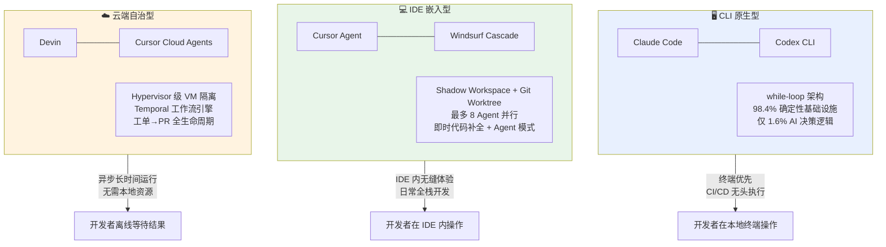
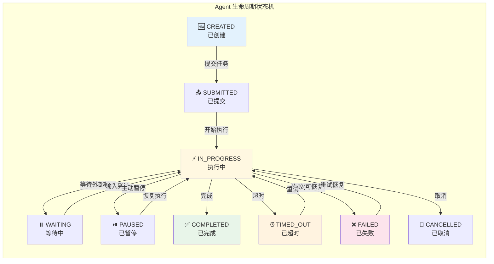
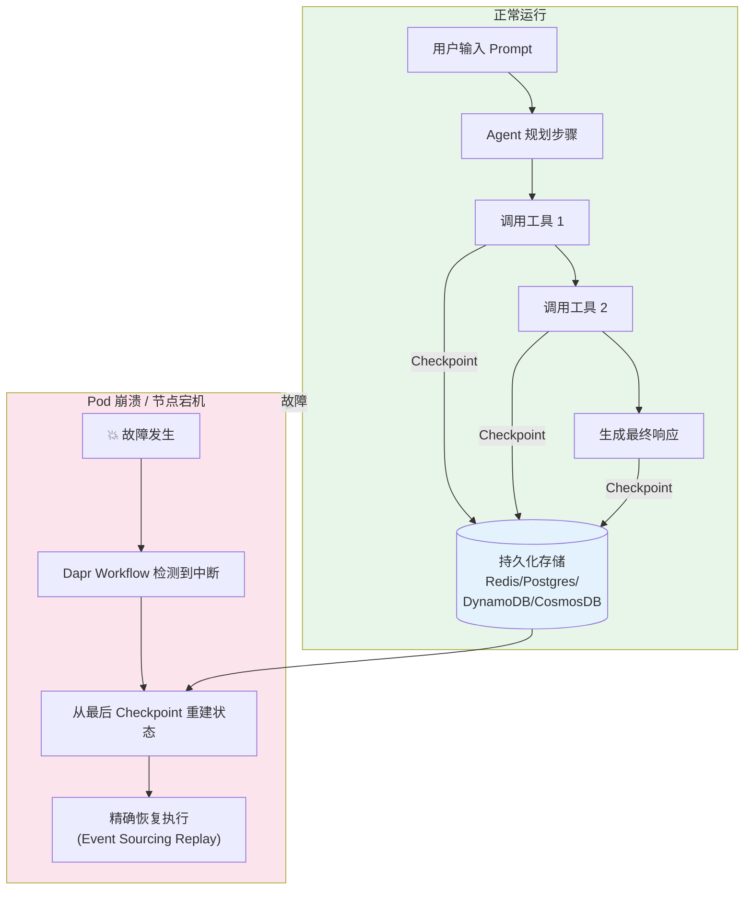

## 第十四章：Agent Harness 与运行时基础设施

> **📌 TL;DR — 本章核心发现** · ⏱ 25 分钟（全章深读）
>
> 1. **Harness 是 Agent 的"操作系统"** — 工具注册、权限控制、沙盒隔离、生命周期管理、多 Agent 编排，五层架构模型承托所有上层 Agent 行为
> 2. **MCP 协议生态爆发** — 9700 万 SDK 下载、21K+ 服务器、IANA 注册表标准化，MCP 正在成为 Agent 工具注册的事实标准
> 3. **Harness 可靠性需要防御纵深** — 幻觉工具调用、权限泄露路径、上下文污染、Agent 崩溃恢复，Harness 层必须提供独立于模型稳健性的安全保障
> 4. **Meta-Harness（AI 管理 AI 的规则）是 2026 Q2 的新趋势** — 三阶段自动化（Init → Audit → Retrospective），但自治理陷阱和成熟度评估仍是开放问题

---

## 目录

| 文件 | 内容 |
|------|------|
| [141-Harness架构模型](141-Harness架构模型.md) | CLI/IDE/Cloud 三条演进路径、五层架构模型、部署拓扑对比 |
| [142-工具注册与MCP协议](142-工具注册与MCP协议.md) | MCP生态爆发（9700万SDK下载/21K+服务器）、标准化进展、工具定义规范 |
| [143-权限模型与沙盒](143-权限模型与沙盒.md) | 7级权限谱系、四种沙盒方案对比、权限泄露路径与最小权限强制方案 |
| [144-上下文与状态管理](144-上下文与状态管理.md) | 上下文窗口预算分配、三层记忆架构、上下文污染检测与隔离 |
| [145-Agent生命周期管理](145-Agent生命周期管理.md) | 正式状态机、长时间运行监控、崩溃恢复与断点续传（Dapr Agents/Devin） |
| [146-多Agent编排引擎](146-多Agent编排引擎.md) | 编排拓扑对比、Agent间通信协议、工作流定义语言三种范式 |
| [147-Harness可观测性](147-Harness可观测性.md) | Trace/Log/Metrics三支柱、Token消耗与成本归因、幻觉工具调用运行时检测 |
| [148-指令文件加载机制](148-指令文件加载机制.md) | ⚠️ 社区逆向分析：Harness拦截层、Read事件驱动触发、新建文件陷阱、paths格式要求、Compaction持久性 |
| [149-Meta-Harness自动化治理](149-Meta-Harness自动化治理.md) | ⚠️ 社区新兴概念：三阶段自动化（Init→Audit→Retrospective）、自治理陷阱、成熟度评估 |

---

## 核心发现

Agent Harness 基础设施在 2025-2026 年的核心进程是从"模型包装器"向"确定性工程系统"的转型——Claude Code 的 98.4% 确定性代码、Dapr Agents 的持久化工作流、Devin 的 Hypervisor 沙盒、MCP 的 IANA 注册表标准化共同指向一个方向：**Agent 的可靠性不再依赖于模型的稳健性，而是依赖于 Harness 层的防御纵深、状态持久性和可观测性。**

2026 年 Q2 的新趋势是 **Meta-Harness（AI 管理 AI 的规则）** 概念的出现，将 Harness 工程本身纳入 AI 辅助的范围——但仍以人为最终裁决者。

---

## 交叉引用

- [第 04 章：后端与API](../../topics/04-后端与API/README.md) — Harness 的权限模型（14.3）与后端的"API Contract = 真相源"共享同一安全哲学：约束先行，执行后验
- [第 06 章：测试与QA](../../topics/06-测试与QA/README.md) — [环形验证问题](../../topics/06-测试与QA/README.md)在 Harness 层的对应：用同一模型做代码生成+代码审查 = 虚假安全感
- [第 09 章：角色重塑](../../topics/09-角色重塑与治理/README.md) — Harness 改变了"谁来操作、谁担责"的分工，[问责制黑洞](../../topics/09-角色重塑与治理/README.md)是 Harness 治理的直接输入
- [第 18 章：提示工程与上下文工程](../../topics/18-提示工程与上下文工程/README.md) — 指令文件的设计哲学与工程实践
- [第 15 章：模型选型与评估](../../topics/15-模型选型与评估/README.md) — 模型能力如何影响 Harness 设计选择
- [第 12 章：横切主题](../../topics/12-横切主题/README.md) — Agent 指令文件成为基础设施的演化路径
- [第 17 章：可观测性与评估](../../topics/17-可观测性与评估/README.md) — Harness 层观测数据的收集与分析
- [参考：Harness 改造实战指南](../../references/harness-transformation-guides.md) — Spring Boot / React 项目的 10-Phase 实践方法

---

> **来源汇总**：VILA-Lab arxiv 2604.14228；MCP Spec 2025-11-25；OWASP Agentic Skills Top 10(2026/03)；CNCF Dapr Agents v1.0；Claude Code 官方文档；社区逆向工程分析（Agiflow、dev.to）；arxiv 2604.11088（Agent 规则研究）

---

## 📎 被以下章节引用

- [第 12 章：横切主题](../../topics/12-横切主题/README.md)
- [141-Harness架构模型](141-Harness架构模型.md)
- [142-工具注册与MCP协议](142-工具注册与MCP协议.md)
- [143-权限模型与沙盒](143-权限模型与沙盒.md)
- [144-上下文与状态管理](144-上下文与状态管理.md)
- [145-Agent生命周期管理](145-Agent生命周期管理.md)
- [146-多Agent编排引擎](146-多Agent编排引擎.md)
- [147-Harness可观测性](147-Harness可观测性.md)
- [148-指令文件加载机制](148-指令文件加载机制.md)
- [149-Meta-Harness自动化治理](149-Meta-Harness自动化治理.md)
- [第 15 章：模型选型与评估](../../topics/15-模型选型与评估/README.md)
- [第 17 章：可观测性与评估](../../topics/17-可观测性与评估/README.md)
- [第 18 章：提示工程与上下文工程](../../topics/18-提示工程与上下文工程/README.md)

## 14.1 Harness 架构模型

> Harness 是 AI 编程 Agent 的"操作系统"——位于大模型 API 和开发者之间，负责工具调用拦截、权限检查、上下文组装和状态持久化。2025-2026 年分化出三条清晰的演进路径。

---

## 14.1.1 三条演进路径

2025-2026 年，AI 编程 Agent 的运行时架构分化出三条路径：**CLI 原生型**、**IDE 嵌入型**和**云端自治型**。三条路径共享同一核心逻辑（Agent Loop），但在沙盒隔离、上下文管理和用户交互模式上存在根本性分歧。



### CLI 原生型：while-loop + 确定性基础设施

**Claude Code** 的核心架构是经典的 Agent Loop：

```javascript
queryLoop() {
  while (running) {
    response = callModel(assembledContext)
    for (toolUse in response) {
      checkPermissions(toolUse)       // 权限门控
      executeHook("PreToolUse")        // Hook 拦截
      result = dispatchTool(toolUse)   // 工具路由
      executeHook("PostToolUse")       // Hook 后处理
      appendToContext(result)          // 上下文累积
    }
  }
}
```

VILA-Lab 对约 51.2 万行 TypeScript 源码的逆向分析揭示了一个关键发现：**仅 1.6% 的代码是 AI 决策逻辑，其余 98.4% 是确定性基础设施**——权限门控、上下文管理、工具路由、崩溃恢复和 Compaction 逻辑。这意味着 Harness 的可靠性不取决于模型，而取决于这 98.4% 的工程质量。

**Codex CLI**（Apache 2.0，2025 年 4 月发布）同样采用 Agent Loop，但基于 OpenAI Responses API（非 Chat Completions），默认模型为 o4-mini。其关键差异化在于：(1) 多提供商支持（OpenAI/Azure/Gemini/Ollama/DeepSeek 等），(2) 开源可审计的沙盒实现，(3) macOS Seatbelt + Linux Docker 的双平台沙盒策略。

### IDE 嵌入型：工作区隔离 + 并行 Agent

**Cursor 2.0** 引入了 **Shadow Workspace** 机制——通过 FUSE（用户态文件系统）实现写时复制（Copy-on-Write）代理文件夹。每个后台 Agent 获得独立的文件系统视图，Agent 写入操作先进入 Shadow 层，人类审查通过后才合并回实际文件系统。配合 Git Worktree，最多支持 **8 个 Agent 并行执行**——每个在独立的分支和工作树中运行，互不干扰。

**Windsurf Wave 13**（2026 年 2 月）推出 **5 路并行 Cascade Agent**，采用同样的 Git Worktree 隔离策略，但增加了专用终端面板——每个 Agent 拥有独立的终端会话，开发者可以实时观察每个 Agent 的命令执行。

IDE 嵌入型的核心优势是 **免配置体验**：开发者无需离开 IDE 即可从"代码补全"平滑过渡到"Agent 自主执行"，上下文自动从当前文件、项目结构和 Git 历史中组装。

### 云端自治型：完全隔离 + 异步执行

**Devin** 运行于云端 VM 沙盒中，采用**计划→执行→验证**三段式架构。配备专有的 SWE-1.6 执行模型（约 950 tokens/sec），从工单（Issue/Ticket）解析需求、规划实施方案、执行代码变更、运行测试验证、提交 PR——全流程无需人类实时参与。关键安全设计是 **Hypervisor 级 VM 隔离**，支持跨异步间隙的状态快照和恢复。

**Cursor Cloud Agents** 基于 Temporal 工作流引擎，每日处理 **5000 万+ Actions**。35% 的合并 PR 由 Cloud Agents 生成——开发者提交任务后关闭 IDE，Agent 在云端继续工作数小时，完成后通过 PR 通知开发者审查。

| 维度 | CLI 原生型 | IDE 嵌入型 | 云端自治型 |
|------|-----------|-----------|-----------|
| **代表** | Claude Code, Codex CLI | Cursor, Windsurf | Devin, Cursor Cloud |
| **沙盒** | 进程级 / OS 级 (Seatbelt) | Git Worktree + FUSE | Hypervisor VM |
| **并行度** | 1 Agent（本地） | 最多 8 Agent | 无限制（云端弹性） |
| **交互模式** | 终端 REPL | IDE 内无缝 | 异步（PR 回调） |
| **最佳场景** | CI/CD 无头执行、脚本化 | 日常全栈开发 | 大规模重构、跨仓库变更 |
| **上下文** | 显式文件 Read 触发 | 自动从 IDE 收集 | 从 Issue/PR 描述组装 |
| **安全模型** | 7 级信任谱系 + ML 分类器 | Shadow Workspace + 审查合并 | VM 全隔离 + 网络策略 |

---

## 14.1.2 五层架构模型

三条演进路径在实现上存在差异，但主流 Harness 实现共享一个**五层参考架构**：


### ① 工具层 — Agent 的"手"

Claude Code 内置 6 种工具类型（Read/Edit/Bash/Glob/Grep/WebSearch），每种工具有独立的输入 Schema 和输出格式。Cursor 通过 Composer Agent 模式提供多文件编辑能力——一个 Agent 调用可同时修改多个文件。Devin 拥有完整 Shell + 编辑器 + 浏览器工具链，使其能执行"打开浏览器查看前端渲染效果 → 修改代码 → 刷新验证"的完整闭环。

**MCP（Model Context Protocol）** 将工具层从"内置"扩展为"开放生态"——9700 万 SDK 下载、21K+ 服务器（详见 [14.2 工具注册与MCP协议](142-工具注册与MCP协议.md)）。

### ② 权限层 — Agent 的"门禁"

Claude Code 的 7 级渐进信任谱系代表了当前最细粒度的权限控制：

| 级别 | 模式 | 行为 |
|:---:|------|------|
| 1 | `plan` | 仅读取和分析，不执行任何变更 |
| 2 | `default` | 每次工具调用前询问用户 |
| 3 | `acceptEdits` | 自动批准文件编辑，Bash 仍需确认 |
| 4 | `auto` | ML 分类器两阶段评估，安全的自动执行 |
| 5 | `dontAsk` | 跳过确认，仅记录日志 |
| 6 | `bypassPermissions` | 绕过所有权限检查（极度危险） |
| 7 | `bubble` | 将权限决策向上传递给父 Agent |

`auto` 模式使用独立 ML 分类器（`yoloClassifier.ts`）进行两阶段工具安全评估——第一阶段判断操作是否"显然安全"（如读取已知文件），第二阶段对边界案例进行概率评估。这确保了权限决策**独立于大模型**——即使模型产生幻觉或被注入恶意指令，权限层仍有独立的判定能力。

### ③ 沙盒层 — Agent 的"隔离舱"

三种沙盒方案在安全性和性能之间取不同平衡点：

| 方案 | 代表 | 隔离强度 | 性能开销 | 适用场景 |
|------|------|:---:|:---:|------|
| **进程级** | Apple Seatbelt (`sandbox-exec`) | ⭐⭐ | 极低 | macOS 本地开发 |
| **容器级** | Docker + iptables | ⭐⭐⭐ | 低 | Linux CI/CD、Codex CLI |
| **VM 级** | Hypervisor (Devin) | ⭐⭐⭐⭐⭐ | 中 | 云端自治 Agent、不可信代码 |

Codex CLI 在 macOS 上使用 Apple Seatbelt（`sandbox-exec`）实现进程级沙盒——限制文件系统访问范围、网络出站连接和系统调用。Linux 上降级为 Docker + iptables。Devin 从容器级升级到 Hypervisor 级 VM 隔离，支持跨异步间隙的状态快照——Agent 可以暂停、保存完整 VM 状态、数小时后恢复执行。

### ④ 编排层

多 Agent 的并行调度、工作流定义和 Agent 间通信。详见 [14.6 多Agent编排引擎](146-多Agent编排引擎.md)。

### ⑤ 观测层

Agent 行为的 Trace/Log/Metrics 三支柱、Token 成本归因和幻觉工具调用检测。详见 [14.7 Harness可观测性](147-Harness可观测性.md)。

---

## 14.1.3 Harness 设计原则：从模型依赖到工程确定性

五层架构的共同设计哲学可概括为三条原则：

1. **独立性原则**：每一层的决策逻辑独立于大模型。权限判定不依赖模型"自觉"，沙盒隔离不依赖模型"自律"，观测审计不依赖模型"自报"。

2. **纵深防御原则**：安全边界不在 Prompt 层（本质是建议性的），而在工具层→权限层→沙盒层的逐层强制执行。即使模型被注入恶意指令，仍需要穿透三层防御才能造成实际损害。

3. **确定性优先原则**：98.4% 的代码是确定性基础设施（非 AI 逻辑），意味着 Harness 的行为可审计、可复现、可验证。当 Agent 行为异常时，问题可以定位到具体的 Harness 层而非"AI 的幻觉"。

> **核心推论**：Harness 的可靠性不再依赖于模型的稳健性，而是依赖于权限门控的细粒度、沙盒隔离的强度和观测审计的完整性。这是从"信任模型"到"信任工程"的范式转移。

---

> **来源**：VILA-Lab《Dive into Claude Code》(arxiv 2604.14228，51.2 万行 TS 源码逆向)；Simon Willison 对 Codex CLI 的分析 (2025/04/16)；Cursor 2.0 Changelog (Shadow Workspace + FUSE)；Windsurf Wave 13 公告 (2026/02)；Cognition Devin 架构文档；Claude Code 官方文档（权限谱系 + Hook 系统）

---

## 📎 被以下章节引用

- [14.6 多Agent编排引擎](146-多Agent编排引擎.md)
- [14.7 Harness可观测性](147-Harness可观测性.md)
- [141-Harness架构模型](README.md)

## 14.2 工具注册与 MCP 协议

> Model Context Protocol（MCP）在2025-2026年经历了从社区协议到工业级标准的跃迁，是Agent工具生态最重要的基础设施变革。

---

## 14.2.1 生态爆发数据

MCP 创下 AI 协议史上最快采纳速度——SDK 月下载量从 2024.11 的 10 万→2025.4 的 800 万→2026.3 的 **9700 万**（970×/18 个月）。去重公共服务器从 ~3（2024.10）→6,878（2025.11）→**21,000+**（2026 中，2,200% 增长）。GitHub 生态 300K+ Stars，89.4% 采用 2025-03-26 稳定协议，93% 使用 Streamable HTTP。2025.12 正式捐献给 Linux Foundation AAIF（联合创始：Anthropic/Block/OpenAI，白金：AWS/Google/Microsoft/Cloudflare/GitHub/Bloomberg）。

安全态势严峻：**38.7% 服务器无需认证、43% 存在命令注入 RCE、仅 8.5% 用 OAuth、仅 2.4% 实施速率限制**——Palo Alto Unit 42 和 Red Hat 一致指出 MCP"从第一天起优先互操作性而非安全"。中位工具数 5 个/服务器，70% 的服务器来自 B2B 企业，81% 的发布者员工 <200 人。

---

## 14.2.2 标准化进展

2025年中期，MCP通过SEP-932建立了正式治理模型，定义了Specification Enhancement Proposal（SEP）流程、工作组和利益群体（SEP-1302）。关键里程碑：

- **2025年11月25日**：引入异步操作（Tasks）实验性支持（SEP-1686）、Sampling中的工具调用（SEP-1577）、OAuth Client ID元数据文档（SEP-991）、Server `.well-known`发现机制、JSON Schema 2020-12作为默认Schema方言（SEP-1613）、SDK分层体系（SEP-1730）
- **2026年5月**：IETF Internet-Draft（`draft-morrison-mcp-tool-surface-names-registry-00`）提出为MCP工具表面名称建立IANA注册表——采用ABNF规范（小写ASCII、下划线分隔、最长64字符），旨在解决跨服务工具名称冲突问题

---

## 14.2.3 工具定义规范

最佳实践已趋收敛：

- 使用 JSON Schema 2020-12 定义工具输入参数，包含 `title`/`description`/`type`/`properties`/`required` 字段
- 输入验证在 MCP Server 端进行，错误通过结构化错误码返回（非纯文本）
- Tool annotations 机制通过 `readOnlyHint`/`destructiveHint`/`idempotentHint` 等语义标记辅助Agent做出安全决策
- Claude Code 的 tools 体系直接内置在 Agent 循环中，MCP Server 工具通过 `mcpServers` 配置动态加载——前者零延迟但不可扩展，后者可扩展但有 RPC 开销
- Claude Code 在启动时将允许的工具列表注入 System Prompt；MCP 则通过 `tools/list` 方法在连接时动态发现

---

## 14.2.4 生态碎片化

33+ 个注册表和市集（Glama 21,500+、MCP.so 20,000+、PulseMCP 12,650、Smithery 7,000-8,000等）形成了碎片化的发现景观。微软、AWS、GitHub、Cloudflare、Stripe 等均发布了官方 MCP 服务器。

---

> **来源**：MCP Spec 2025-11-25 Changelog；IETF草案draft-morrison-mcp-tool-surface-names-registry-00；Zarq AI《State of AI Assets Q1 2026》；Graham Dues《MCP in 2026: The numbers behind the ecosystem explosion》

---

## 📎 被以下章节引用

- [142-工具注册与MCP协议](README.md)

## 14.3 权限模型与沙盒

> Agent的安全基础设施在2025-2026年出现了两种根本不同的哲学路线：**"门控命令+沙盒进程"**和**"门控环境+内部全权"**。

---

## 14.3.1 权限分级实践

**Claude Code** 实现了业界最精细的7级权限渐进谱系。其Auto模式的核心是`yoloClassifier.ts`——一个独立的LLM调用，采用两阶段评估（快速过滤+思维链），与超时机制竞速以提供预计算分类。权限授权管线包含4个阶段：预过滤（从模型可见工具集中移除被拒绝的工具）、PreToolUse钩子拦截、拒绝优先的规则评估（宽泛deny始终覆盖狭窄allow）、以及权限处理器分支。关键安全特性：权限从不跨会话持久化——每次会话重新建立信任。

**Codex CLI** 采用更简洁的三层审批：Suggest（默认：读文件自动、写文件需审批、Shell需审批）、Auto Edit、Full Auto（网络禁用、目录沙盒化的全自动）。**Cursor** 基于Manifest的权限模型，通过`.cursorrules`和Agent配置声明可访问范围。**Devin** 采用环境级门控——Agent在隔离VM中获得root权限。

---

## 14.3.2 沙盒实现对比

| 方案 | 实现 | 隔离级别 | 关键限制 |
|------|------|:---:|------|
| Container | OpenHands Docker、Devin早期 | 进程级 | `/var/run/docker.sock`暴露——容器逃逸等于宿主机完全访问 |
| Hypervisor VM | Devin Firecracker类微VM | 内核级 | 支持跨异步间隙的全机状态快照 |
| 进程级 | Claude Code/Cursor/Codex CLI (Apple Seatbelt/Landlock LSM/seccomp-bpf/bubblewrap) | OS内核原语 | macOS Seatbelt、Linux Landlock、Windows→WSL2回退 |
| Firecracker微VM | AgentSafe/E2B/Microsandbox | 独立内核 | <200ms启动、<5MiB开销 |
| 事务性沙盒 | 文件系统快照包装Agent动作 | 文件级 | 100%高风险命令拦截、100%回滚成功率、14.5%性能开销 |

---

## 14.3.3 权限泄露路径

OWASP Agentic Skills Top 10平台对比（2026年3月更新）揭示了两类关键漏洞模式：

- **仓库配置文件即执行层**：克隆不可信项目可能触发自动执行——配置文件中的指令在同意对话框出现前即可被解析执行
- **IDEsaster类漏洞**：影响Cursor/Windsurf——提示注入+自动Agent动作+合法IDE API组合导致密钥泄露和远程代码执行
- **恶意Payload**：76+个已确认的恶意Payload在技能生态系统中被发现（Snyk ToxicSkills，2026年2月）

**最小权限强制方案**：(1) 拒绝优先规则引擎（宽泛deny覆盖狭窄allow），(2) OS级沙盒作为纵深防御，(3) Android式权限清单（AgentBound实现80.9%自动生成策略准确率、0.6ms开销），(4) HMAC签名的工具执行收据——LLM无法伪造的密码学证明。

---

> **来源**：OWASP Agentic Skills Top 10(2026/03)；arxiv 2512.12806(Transactional Sandboxing)；arxiv 2511.20920(MCP Security)；AgentBound论文

---

## 📎 被以下章节引用

- [14.3 权限模型与沙盒](147-Harness可观测性.md)
- [14.3 权限模型与沙盒](148-指令文件加载机制.md)
- [143-权限模型与沙盒](README.md)
- [14.3 权限模型与沙盒](../../topics/18-提示工程与上下文工程/186-DESIGN.md与意图工程.md)

## 14.4 上下文与状态管理

> Agent面临两种根本性的"失忆症"：跨会话遗忘和会话内漂移（指令随上下文增长而失去影响力）。

---

## 14.4.1 上下文窗口预算分配

Claude Code基于200K Token上下文窗口（Opus 4/Sonnet 4），推荐预算分配：

| 组件 | 大小 | 占窗口比例 |
|------|------|:---:|
| CLAUDE.md（50-100行） | ~2,000-4,000 Token | 2-5% |
| 模块化规则 | ~2,400 Token | ~1% |
| Auto MEMORY.md | ~1,200-2,000 Token | ~1% |
| **合计** | **~6,000-9,600 Token** | **~5%** |

实际会话中的分布：System Prompt + CLAUDE.md占3-8%（5K-15K）、已读文件占25-60%（50K-120K）、对话历史占15-40%（30K-80K）、生成响应占10-25%（20K-50K）。自动压缩在约95%填充（190K Token）时触发，压缩会保留CLAUDE.md、MEMORY.md和当前编辑文件，但会丢失路径作用域规则和嵌套子目录CLAUDE.md。

Anthropic平台级的Context Editing能力（`clear_tool_uses_20250919`）在100轮网页搜索评估中将Token消耗降低**84%**，结合Memory Tool后Agent性能提升**39%**。

---

## 14.4.2 记忆的层次化设计

**第一层——文件级持久记忆（CLAUDE.md）**：4级加载层次（组织级→用户级→项目级→本地/个人级），加载顺序合并，更具体的位置优先级更高。路径作用域规则（`.claude/rules/`中带YAML frontmatter的文件）仅在匹配文件被读取时加载，节省Token。

**第二层——会话状态**：对话历史、压缩摘要、当前计划和任务队列。Claude Code通过`/compact`、`/clear`、`/resume`命令管理会话。

**第三层——长期跨会话记忆**：MCP Memory Keeper（SQLite持久化+Checkpoint系统）、Claude Subagent Memory（每个子Agent维护4文件结构：work-history.md、current-focus.md、expertise.md、lessons.md）、以及Succession Identity Cycle（使用身份卡实现行为记忆，PostToolUse刷新门确保规则保持在注意力附近而非埋藏在150K Token之后）。

---

## 14.4.3 上下文污染检测与隔离

子Agent是最关键的上下文隔离原语——以约7x Token开销换取完全独立的新上下文窗口，只有摘要返回父会话。Claude Code的三种隔离模式：

- **Worktree**：Git Worktree文件系统隔离
- **Remote**：内部远程执行
- **In-Process**：共享文件系统但隔离对话

跨项目隔离通过Git Worktree加`.claude/`目录的项目级作用域实现。上下文漂移的实证数据：Succession实验显示，CLAUDE.md-only方案在pytest-dev/pytest上产生0次有效的`replsh eval`调用，而PostToolUse刷新门产生了18次——证明仅靠启动时注入指令不足以维持长时间会话中的规则遵循。

---

> **来源**：Claude Code官方文档（Context Window/Memory）；Succession/身份周期论文(danieltanfh95/agent-lineage-evolution)；Anthropic Context Management博文；MCP Memory Keeper项目；Sfeir Institute深度指南

---

## 📎 被以下章节引用

- [14.4 上下文与状态管理](146-多Agent编排引擎.md)
- [14.4 上下文与状态管理](148-指令文件加载机制.md)
- [14.4 上下文与状态管理](149-Meta-Harness自动化治理.md)
- [144-上下文与状态管理](README.md)

## 14.5 Agent 生命周期管理

> Agent 生命周期管理在 2025-2026 年从"尽力而为"到"正式状态机 + 崩溃恢复"完成了关键跃迁。Dapr Agents v1.0 的持久化工作流代表了当前最成熟的工程方案——Agent 不再是一次性的"函数调用"，而是可暂停、可恢复、可审计的长期运行实体。

---

## 14.5.1 完整生命周期状态机

多个框架独立定义了正式的 Agent 状态机，虽然命名不同但状态转换逻辑高度收敛：



### 各框架的状态机对比

| 框架 | 状态定义 | 特色机制 |
|------|---------|---------|
| **AXME** | CREATED→SUBMITTED→DELIVERED→ACKNOWLEDGED→IN_PROGRESS→WAITING→COMPLETED/FAILED/CANCELLED/TIMED_OUT | 最完整的状态枚举，ACKNOWLEDGED 态支持人机交接 |
| **OpenAgentOrchestrator** | INIT→PLAN→EXECUTE→REVIEW→TERMINATE | REVIEW 阶段作为质量门禁，不合格则退回 EXECUTE |
| **Parsica Ventures** | start→pause→resume→abort | 双策略 Checkpoint：Token 阈值 + 时间间隔触发存档 |
| **Devin** | 任务分配→沙盒供给→仓库摄取→交互规划→自主执行→内部 CR→PR 创建→状态持久化 | v3.0 支持人工审查修改规划，反馈驱动恢复 |

**Devin 的完整流水线**值得展开：任务分配（通过 Slack/API/Windsurf IDE 三种入口）→ 沙盒供给（云 VM 启动 + 仓库克隆，启动延迟约 2-5 秒）→ 仓库摄取（企业版支持千万 Token 级上下文窗口）→ 交互式规划（v3.0，可人工审查修改计划步骤）→ 自主执行（编写代码、运行测试、自愈诊断）→ 内部代码审查（Devin 自身先审查再提交）→ PR 创建 → 状态持久化（CI 失败或评审反馈时快照并挂起，反馈到达时从精确断点恢复）。

---

## 14.5.2 长时间运行 Agent 的监控与超时

长时间运行的 Agent（数小时到数天）带来了独特的工程挑战：如何在不过度消耗资源的前提下确保 Agent 仍在"正确运行"而非陷入死循环？

| 策略 | 实现 | 适用场景 |
|------|------|---------|
| **心跳轮询** | Parsica Ventures：Supervisor 每 30 秒检查执行器存活，3 次连续失败 → FAILED + `recoverable=True` | 分布式 Agent 集群 |
| **预授权后台** | Claude Code：`Ctrl+B` 发送后台，权限在启动前预批准，未授权工具自动拒绝 | 本地开发 Agent |
| **事件黑板** | Glink Engine (v0.3.4)：JSONL 追加式事件日志，每步成功 Checkpoint，重启精确续传 | 需要审计追踪的场景 |
| **Token 预算硬限制** | 企业普遍实践：单 Agent 最大步数 + 总 Token 上限，防止"Token 暴走"（详见 08-生产运维 FinOps） | 所有生产环境 |

**关键反直觉洞察**：最危险的 Agent 不是失败的那个，而是**看似正常运行但效率极低**的那个——它每小时消耗数千 Token 却未产出有效结果。健康检查需要同时监控"是否活着"和"是否在有效工作"（如 PR 进展/测试通过率变化）。

### 超时策略分级

| 级别 | 超时 | 行为 |
|:---:|------|------|
| 单个工具调用 | 30-120s | 超时 → 重试（最多 3 次）→ 跳过该工具 |
| 单步推理 | 60-300s | 超时 → 要求模型重新推理 |
| 整个 Agent 会话 | 可配置（分钟到小时） | 超时 → 挂起 + 通知用户 |
| 后台 Agent 总时长 | 可配置上限 | 超时 → 强制终止 + 保留上下文快照 |

---

## 14.5.3 崩溃恢复与断点续传

### Dapr Agents v1.0：持久化工作流的黄金标准

**Dapr Agents v1.0**（2026 年 3 月 23 日 GA，CNCF 毕业项目）代表了当前最成熟的崩溃恢复方案。核心思路是将每个 Agent 调用建模为**持久化工作流**——不仅仅是对话记忆（如 LangChain Memory），而是用户输入、中间决策、工具调用、模型响应的**全量持久化**。



**四项核心机制**：

1. **事件溯源/重放模型**：`ContextAwareLogger` 在重放周期中静默抑制重复日志——开发者看到的日志与正常执行完全一致，无需区分"新执行"还是"重放执行"。

2. **精确一次执行保证**：基于 Dapr Actor 架构——即使多个恢复实例同时启动（如 K8s 重启 Pod），Actor 的单线程执行模型确保只有一个实例实际执行，消除重复副作用。

3. **持久化重试**：非暂态 `retry + timeout`，而是由工作流状态支持的**长期失败重试**——Agent 可以等待数小时（等待外部 API 恢复、等待人工审批）后继续。

4. **30+ 状态存储后端**：Redis、Postgres、DynamoDB、CosmosDB、Cassandra 等——团队可以在现有基础设施上启用，无需引入新依赖。

### Devin 的四级自愈协议

Devin 定义了递增的四级恢复策略，从自动化到人工介入：

| 级别 | 策略 | 触发条件 | 行为 |
|:---:|------|---------|------|
| 1 | **RETRY** | 瞬时错误（网络超时/API 限流） | 自动重试最多 3 次，指数退避 |
| 2 | **FIX** | 代码错误（测试失败/lint 报错） | 诊断 → 生成补丁 → 重新测试 |
| 3 | **ROLLBACK** | 不可挽救的破坏性更改 | 回滚到上一个 Checkpoint → 重新规划方案 |
| 4 | **ESCALATE** | 连续 2 次失败后的未知/关键错误 | 挂起 + 保存完整上下文 + 通知人工介入 |

### OpenAgentOrchestrator 的幂等性保障

使用 **SHA-256 工具调用哈希**防止重试时的重复外部动作——每个工具调用（如 `POST /api/orders`）被哈希后存入 Redis。重试前检查哈希是否已存在，若存在则跳过执行直接返回缓存结果。基于 Redis `RPOPLPUSH` 实现**零丢失任务认领**——Worker 崩溃时，正在处理的任务自动回到队列头部。

---

> **来源**：CNCF Dapr Agents v1.0 GA 公告 (2026/03/23)；Diagrid Dapr Agents 1.0 技术解读；Parsica Ventures v0.5.0；Glink Engine v0.3.4 (2026)；AXME 文档；Devin 架构分析；OpenAgentOrchestrator 设计文档

---

## 📎 被以下章节引用

- [145-Agent生命周期管理](README.md)

## 14.6 多 Agent 编排引擎

> 多Agent编排在2025-2026年从单一Agent的简单并行演变为复杂的角色分工、层级委托和持久化工作流拓扑。

---

## 14.6.1 编排拓扑实现

**Claude Code Workflow** 采用计划-执行模式：主Agent在plan模式下生成任务分解，通过`TaskCreate`/`TaskUpdate`工具管理结构化任务表，子Agent（`AgentTool`）独立执行并汇报进度。每个子Agent拥有独立上下文窗口（约7x Token开销但上下文安全），支持最多10个并行子Agent，通过POSIX `flock()`实现零外部依赖的多实例协调。

**Cursor Cloud Agents** 基于Temporal工作流引擎实现大规模编排：每个Agent获得独立云端VM，子Agent（Child Workflows）复用父环境但拥有全新上下文，采用Signal-with-Start模式向运行中或新启动的工作流注入后续提示。实验性Planner/Worker/Judge模式针对超长任务（数周）：Planner作为架构师持续探索代码库并派生子规划者，Worker纯粹执行直至提交，Judge周期性评估进展。

**Windsurf Wave 13** 的5路并行Cascade Agent通过Git Worktree隔离和Arena Mode（双Agent盲比输出）实现开发期编排。

**Devin** 采用层级化多Agent系统：管理者Devin拆分大型任务→派生子Devin→内部MCP协调→Map-Reduce-Manage模式，关键原则是写入保持单线程（额外Agent贡献智能而非并行代码更改）。

---

## 14.6.2 Agent 间通信协议

三种模式各有优势：

| 模式 | 实现 | 适用场景 |
|------|------|---------|
| **消息传递** | Claude Code子Agent的summary回传、Cursor的Temporal Signal | 任务委托，清晰的所有权分离 |
| **共享状态** | Dapr Agents的Pub/Sub消息总线、Glink Engine的JSONL事件黑板 | 松散耦合的多Agent协作，至少一次投递保证 |
| **黑板模式** | Parsica Ventures的中央事件追加日志、OAO的不可变事件溯源日志 | 天然崩溃恢复——从事件日志重放即可重建完整运行时状态 |

---

## 14.6.3 工作流定义语言对比

当前存在三种范式：

**Markdown/YAML声明式**：Claude Code的`.claude/agents/*.md` + YAML frontmatter，定义name/description/tools/model/permissionMode/maxTurns/memory/skills等全部元数据；DevFlow的`workflow.yaml` + `agents.yaml` + `rules.yaml`，定义9种专业Agent和5种工作流模板。

**代码/SDK式**：Dapr Agents的Python `DurableAgent`类、defineworkflow的TypeScript虚拟机沙盒+日志序列号、Parsica Ventures的`VentureBuilder`链式API。

**纯Prompt式**：Cursor的Composer指令、Windsurf的Cascade对话指令、Spec Kit/OpenSpec/BMAD-Method的记忆文件和模板编排。

Declarative方案的YAML frontmatter已成为事实标准的Agent配置格式——Claude Code、OpenClaw、DevFlow、MCP Agent Swarm均采用此模式。Dapr Agents v1.0则代表了另一种方向：将Agent编排完全融入云原生基础设施。Cognition（Devin/Windsurf母公司）明确拒绝了"非结构化的协商Agent群"——称其"基本上是干扰"，坚持写入单线程化、智能并行化。

---

> **来源**：Claude Code Subagents/Custom Agents文档；Tembo《Claude Code Subagents: A 2026 Practical Guide》；Cursor社区论坛Long-Running Multi-Agent线程；Windsurf Wave 13公告；Cognition生产多Agent模式；Dapr Agents文档

---

## 交叉引用

- [14.4 上下文与状态管理](144-上下文与状态管理.md) — 子Agent的上下文隔离机制
- [16.3 角色分工与责任边界](../../topics/16-多Agent系统与协作/163-角色分工与责任边界.md) — 多Agent系统中的角色专业化
- [16.2 多Agent通信与协调](../../topics/16-多Agent系统与协作/162-多Agent通信与协调.md) — Agent间通信协议的深入分析

---

## 📎 被以下章节引用

- [14.6 多Agent编排引擎](141-Harness架构模型.md)
- [14.4 上下文与状态管理](144-上下文与状态管理.md)
- [146-多Agent编排引擎](README.md)
- [16.2 多Agent通信与协调](../../topics/16-多Agent系统与协作/162-多Agent通信与协调.md)
- [16.3 角色分工与责任边界](../../topics/16-多Agent系统与协作/163-角色分工与责任边界.md)

## 14.7 Harness 的可观测性

> Agent行为可观测性在2025-2026年从"事后看Token消耗列表"快速演进为正式的Trace/Log/Metrics三支柱体系。

---

## 14.7.1 Trace/Log/Metrics 三支柱

**Future AGI的Agent Command Center** 代表了最完整的商业方案：端到端的Agent会话Trace（每一步工具调用、推理决策、输入输出和错误），OpenTelemetry GenAI语义约定作为2026年度的追踪标准（`gen_ai.client.token.usage`、`gen_ai.client.cost.usd`、`gen_ai.request.model`等），OpenInference（Apache 2.0）发布`llm.*`/`retrieval.*`/`tool.*`/`embedding.*`/`chain.*`规范属性命名空间。

**Dapr Agents** 提供最完整的开源方案：基于W3C Trace Context传播的完整OpenTelemetry追踪（跨Agent、工具和LLM调用），Prometheus指标暴露，`ContextAwareLogger`自动处理重放日志去重。

**各大Harness的观测成熟度**：

| Harness | 观测能力 |
|---------|---------|
| Claude Code | `/context`显示实时上下文使用量、`/cost`显示Token消耗和费用、`/doctor`诊断安装问题、`.jsonl`格式Sidechain Transcript记录子Agent完整执行历史 |
| Cursor | Agent Window提供运行时Agent列表视图 |
| Devin | Web Dashboard展示任务执行步骤和状态 |

**第三方观测工具生态**：Langfuse（自托管、MIT许可）、LangSmith（LangChain生态整合）、Helicone（基于代理，零代码改URL）、AgentOps（400+集成、会话回放、时间旅行调试）。

---

## 14.7.2 Token 消耗追踪与成本归因

行业共识：成本是一个Span属性，不是独立的账单问题。标准实现模式为：网关处理器在响应返回前设置`llm.token_count.prompt`/`completion`/`total`和`llm.cost_usd`到Span上。多层预算体系（组织→团队→用户→密钥→标签）在网关层强制执行，80%警告阈值+硬/软模式，结构化429响应告知调用者哪个层级被阻止。

LangCost（开源npm包）代表了本地成本智能方向——6条浪费检测规则（工具失败、Agent循环、重试模式、高输出、低缓存、模型洞察），兼容Claude Code/OpenClaw/Warp/Cline。

关键指标已从 **Cost-per-Token** 转向 **Cost-per-Outcome**（每次解决的对话成本、每个被接受的PR成本等）——这能捕获便宜模型循环2倍多导致结果反而更贵的退化情况。

---

## 14.7.3 幻觉工具调用的运行时检测

2025年的前沿方案汇集到同一范式：**不信任LLM会诚实地报告工具返回了什么**。具体技术包括：

- **密码学工具收据**（NabaOS/Tool Receipts）：HMAC签名的工具执行证明——LLM从未持有签名密钥因此无法伪造，实现94.2%的伪造工具引用检测、87.6%的计数误报检测、91.3%的虚假缺失声明检测，约**15ms**验证开销
- **Token级实时检测**（HaluGate）：Rust/Candle原生实现（<500ms冷启动），Sentinel（ModernBERT，~12ms）判断Prompt是否需要事实核查→Detector（token级二分类，~45ms）标记无支撑Token→Explainer（NLI，~18ms），总延迟**76-162ms**
- **Go SDK运行时验证**（hguard-go v0.5.0）：Schema验证+上下文感知策略+自动纠正工具名称拼写错误
- **声明到证据的溯源图**（Statsig/Future AGI/Revefi）：每个断言必须可追溯到特定工具输出或源数据

---

> **来源**：Future AGI《What Is LLM Observability? A 2026 Architecture Guide》；Fiddler AI《Your MCP Agent Is Failing Silently》(2026/05)；arxiv 2603.10060(Tool Receipts)；HaluGate技术博文；Dapr Agents v1.0 Observability文档

---

## 交叉引用

- [17.1 Agent可观测性三支柱](../../topics/17-可观测性与评估/171-Agent可观测性三支柱.md) — 更深入的可观测性框架分析
- [17.3 成本可观测性](../../topics/17-可观测性与评估/173-成本可观测性.md) — Token消耗与成本归因的详细实践
- [14.3 权限模型与沙盒](143-权限模型与沙盒.md) — 工具执行收据与权限控制的结合

---

## 📎 被以下章节引用

- [14.7 Harness可观测性](141-Harness架构模型.md)
- [14.3 权限模型与沙盒](143-权限模型与沙盒.md)
- [147-Harness可观测性](README.md)
- [17.1 Agent可观测性三支柱](../../topics/17-可观测性与评估/171-Agent可观测性三支柱.md)
- [17.3 成本可观测性](../../topics/17-可观测性与评估/173-成本可观测性.md)

## 14.8 指令文件加载机制

> ⚠️ **方法限定**：本分析基于 Claude Code CLI Q2 2026 的观测行为，源自社区逆向工程和文档分析，非 Anthropic 官方源码。实现细节可能随版本变化。

---

## 14.8.1 Harness 拦截层架构

**Harness ≠ Claude（大模型）**。Harness 是 Claude Code CLI 的本地运行时引擎，负责上下文组装、工具调用拦截和权限执行：

```text
┌──────────────────────────────────────────┐
│  Claude Code CLI（本地进程）              │
│  ┌────────────────────────────────────┐  │
│  │  Harness（编排引擎）                 │  │
│  │  - 加载 CLAUDE.md / rules/         │  │
│  │  - 权限检查                          │  │
│  │  - Hook 执行（PreToolUse/Post）     │  │
│  │  - ★ 路径规则匹配                    │  │
│  │  - 工具调用的实际执行               │  │
│  │  - 上下文组装与注入                 │  │
│  └────────────────────────────────────┘  │
│                   │ API 调用              │
│                   ▼                      │
│  Claude 大模型（Anthropic API）           │
│  - 接收 Harness 组装好的上下文           │
│  - 不知道路径规则是动态注入的 ☆          │
└──────────────────────────────────────────┘
```

Harness 的五项核心职责：(1) 会话初始化——加载 CLAUDE.md、CLAUDE.local.md、父目录 CLAUDE.md、rules/*.md（无 paths 者），(2) 上下文组装——拼装 System Prompt + 对话历史，(3) 工具调用拦截——权限检查→Hook执行→实际操作，(4) 路径规则匹配——仅在 Read 工具调用时触发，(5) 上下文压缩——从磁盘重读 CLAUDE.md 和 rules/。

VILA-Lab 对约 51.2 万行 TypeScript 源码的分析确认了这一架构：**仅 1.6% 的代码是 AI 决策逻辑，其余 98.4% 是确定性基础设施**——Harness 正是这 98.4% 的核心。

---

## 14.8.2 路径规则的触发机制

**关键原理：路径规则在 Read 工具调用时触发，不在 Write/Edit 时触发。**

完整触发流程：

```text
Step 1: 用户输入 Prompt → Harness 组装 System Prompt
        加载 CLAUDE.md + CLAUDE.local.md + rules/*.md（无 paths）
        rules/*.md（有 paths）→ 跳过，尚未触发

Step 2: Claude（API端）输出 tool_use { Read: "XController.java" }

Step 3: ★ Harness 拦截层 —— 路径规则生效时刻 ★
        3a. 接收 tool_use 指令
        3b. 权限检查
        3c. PreToolUse Hook 执行
        3d. 执行 Read，读取文件内容到内存
        3e. 路径规则匹配：
            遍历 .claude/rules/*.md
            文件路径 vs glob pattern
            controller.md → paths: "**/controller/**" → 匹配 ✅ → 注入
            service.md    → paths: "**/service/**"    → 不匹配 ❌ → 跳过
        3f. 组装 tool_result { content + appended_rule }

Step 4: Harness 把 tool_result 发回 API
        Claude 看到：文件代码 + controller.md 约束
```

**哪些工具触发路径匹配**：

| 工具 | 触发路径匹配 | 说明 |
|------|:---:|------|
| Read | ✅ | 读文件时 Harness 执行 glob 匹配 → 注入规则 |
| Write | ❌ | 写文件时不执行路径匹配 |
| Edit | ❌ | 编辑文件时不执行路径匹配 |
| Bash/Grep/Glob | ❌ | 搜索时不执行路径匹配 |

注意：如果此前 Read 过同目录的文件，规则已在上下文中，后续 Write/Edit 时可用。

---

## 14.8.3 注入位置：System Prompt vs 对话历史

路径规则不是注入到 System Prompt 中，而是注入到**对话历史**（tool_result）中：

- **System Prompt**（固定，会话级别）：CLAUDE.md + CLAUDE.local.md + rules/*.md（无 paths）——会话期间不变
- **对话历史**（动态增长）：路径规则在这里注入——当 Read 返回时，Harness 在返回结果后附加匹配的规则内容。随会话增长，可能被截断

**对持久性的影响**：当上下文窗口满触发 Compaction 时，CLAUDE.md 和 .claude/rules/ 从磁盘重新读取。System Prompt 中的全局规则始终保持；对话历史中的路径规则可能被截断，但 Compaction 后重新触发 Read 时再次注入。

---

## 14.8.4 "新建文件陷阱"

**路径规则在新建文件时不触发。** 这是当前机制最危险的缺口：

```text
Claude: Write("ProductController.java")  ← 新文件

Harness 检查：
  文件是否存在？→ 否
  → 不执行 Read
  → 不触发路径匹配
  → controller.md 不加载

后果：Claude 写 ProductController 时看不到 controller.md 的约束
```

社区将此问题跟踪为 `anthropics/claude-code#23478`。已知缓解方案是通过 PreToolUse Hook 强制新建文件前先 Read：

```json
{
  "hooks": {
    "PreToolUse": [{
      "matcher": "Write",
      "reason": "强制新建文件前先 Read 以加载路径规则",
      "command": "bash -c 'if [ ! -f \"$CLAUDE_TOOL_FILE_PATH\" ]; then echo \"文件不存在，请先用 Read 读取目标路径以加载相关规则，然后再 Write。\" && exit 2; fi'"
    }]
  }
}
```

原理：Hook 阻止 Write → 提示 "请先 Read" → Claude 执行 Read（文件不存在但路径匹配触发）→ 规则注入 → 再次 Write 时规则已在上下文中。这种"rules-on-create Hook"实际中将新建文件的规则覆盖率从 ~0% 提升至接近 100%。

---

## 14.8.5 `paths:` 格式陷阱

YAML frontmatter 中的 `paths:` 字段**必须使用 CSV 字符串格式**，YAML 数组格式会被静默忽略：

```yaml
# ❌ YAML 数组格式 — 规则被静默忽略！
---
paths:
  - "**/controller/**"
  - "**/*Controller.java"
---

# ✅ CSV 字符串格式 — 正常工作
---
paths: "**/controller/**,**/*Controller.java"
---
```

这是社区发现的最常见的配置错误。`tools:`、`disallowedTools:`、`allowed-tools:` 字段同理。

---

## 14.8.6 与其他工具的机制差异

路径作用域规则存在三种根本不同的实现思路：

| 思路 | 代表工具 | 触发方式 | 优点 | 缺点 |
|------|---------|---------|------|------|
| **Read 工具拦截** | Claude Code | Read 时 Harness 拦截→glob 匹配→注入 | 精准按需注入，Token 效率最高 | Write/Edit 不触发，新建文件盲区 |
| **每次请求匹配** | Cursor、Windsurf、Copilot | 每次 AI 请求检查当前操作文件路径→注入 | 覆盖所有操作 | 每次请求有匹配开销 |
| **无作用域，始终加载** | Aider、Codex CLI rules | 规则始终作为上下文加载 | 简单，不遗漏 | 规则多时 Token 浪费严重 |

Claude Code 的 Read 触发模式是**唯一按需注入**的实现——在当前工具生态中代表了 Token 效率的极致，但代价是新建文件场景下的覆盖缺口。

---

> **来源**：Agiflow《Claude Code Internals: Reverse Engineering Prompt Augmentation》；dev.to《How Claude Code Rules Actually Work》；SSW《Scoped Rules for AI Agents》；社区 GitHub Issues（anthropics/claude-code#23478）

---

## 交叉引用

- [14.4 上下文与状态管理](144-上下文与状态管理.md) — Compaction 如何影响规则持久性
- [18.3 指令文件工程](../../topics/18-提示工程与上下文工程/183-指令文件工程.md) — CLAUDE.md/AGENTS.md/Cursor Rules 的设计哲学对比
- [14.3 权限模型与沙盒](143-权限模型与沙盒.md) — Hooks 作为确定性强制执行的载体

---

## 📎 被以下章节引用

- [14.3 权限模型与沙盒](143-权限模型与沙盒.md)
- [14.4 上下文与状态管理](144-上下文与状态管理.md)
- [148-指令文件加载机制](README.md)
- [14.8 指令文件加载机制](../../topics/18-提示工程与上下文工程/183-指令文件工程.md)

## 14.9 Meta-Harness：AI 管理 AI 的规则

> ⚠️ **方法限定**：Meta-Harness 是 2026 年社区新兴概念，非正式学科。所述工具为社区维护的 npm 包，成熟度各异。done-gate.js 案例为单一个人实验，普适性待验证。

---

## 14.9.1 核心命题

Harness 工程本身也是一个软件工程问题。Meta-Harness 的核心命题是：**Harness 的创建、维护和演进能否交给 AI 辅助——只要人保留最终决策权？**

```text
传统 Harness 工程：
  人分析项目 → 人写 CLAUDE.md → 人配置 Hook → 人维护规则

Meta-Harness：
  AI 分析项目 → AI 起草规则 → 人审查 → AI 执行巡检 →
  AI 发现腐化 → AI 提议修改 → 人审批 → AI 应用变更
```

人从**执行者**变成**裁决者**。这直接呼应了 VILA-Lab 的发现——如果 98.4% 的 Harness 代码是确定性基础设施，那么这 98.4% 的创建和维护本身可以部分自动化。

---

## 14.9.2 已有基础设施

**内置能力**：Claude Code 的 `/init` 命令自动扫描项目目录结构、构建配置、依赖和 CI/CD 管道，生成结构化的 CLAUDE.md。特点是可重复运行、不编造内容、跳过通用建议。

**社区工具生态**（2026 Q2）：

| 工具 | 能力 | 成熟度 |
|------|------|:---:|
| **claudenv** (npm) | 一键生成 CLAUDE.md + rules/ + hooks/ + skills/ + MCP + memory；self-extending harness；autonomy profiles（safe/moderate/full/ci） | 🟡 社区级 |
| **@eastagile/claude-harness** (npm) | 12 个并行子进程分析代码库各维度；gardener 定时审计文档引用 vs 实际代码→自动 fix commit | 🟡 社区级 |
| **vibe-claude** | 极简 Harness（5 文件 / 2 Hooks / 5 规则）；核心：stop-guard Hook（阻止无证据的"完成"） | 🟡 社区级 |
| **@scriptdude/claude-init** (npm) | 增强版 init：个性化配置 + AST 分析 + 质量评分（0-100） | 🟡 社区级 |
| **claude-mpm** | 多 Agent 并行分析：auth patterns / data access / business domain / infrastructure | 🟡 社区级 |

**Anthropic 原生能力**：Auto Memory（自动将构建命令、调试发现写入 `~/.claude/projects/<project>/memory/`）、Dynamic Workflows（Agent 自编多 Agent 编排脚本）、Stop Hook（每次任务完成后触发自改进循环）。

---

## 14.9.3 三阶段自动化

### 阶段 1：项目初始化（Init）

新项目加入 Harness 体系的目标流程：

```text
Step 1: AI 扫描项目
  claude /init → 自动生成 CLAUDE.md（项目索引）
  claudenv    → 自动生成 rules/ + hooks/ + skills/ + settings.json

Step 2: AI 起草 DESIGN.md
  → 分析代码中的模式和选型 → 逆向推断已有架构决策 → 生成草案

Step 3: 人工审查（不可跳过）
  □ CLAUDE.md 的构建命令是否准确？
  □ 推断的架构描述是否与实际一致？
  □ Hook 逻辑是否正确？边界条件是否覆盖？

Step 4: 提交 → PR 合入仓库
```

### 阶段 2：日常巡检（Audit）

巡检 Agent 的四项核心检查：

1. **规则与代码一致性**：CLAUDE.md 的目录结构是否仍存在？构建命令是否仍能运行？rules/*.md 中 paths: 匹配的目录是否还存在？DESIGN.md 中的决策是否仍被遵守？
2. **Hook 有效性**：settings.json 中的 Hook 命令是否可执行？最近一周哪些拦截是假阳性？
3. **规则覆盖缺口**：最近 PR Code Review 中最常见的意见中哪些可通过新增规则自动拦截？
4. **冗余检测**：哪些规则已被 Lint 工具覆盖？哪些路径规则超过 30 天未触发？

### 阶段 3：周期性复盘（Retrospective）

"Rules from Failures" 循环：

```text
每次 Claude 犯错      → 建议追加一条规则到 CLAUDE.md
每次 Review 重复意见   → 建议创建一个 Skill
每次 Bug 溜过门禁     → 建议新增一个 Hook
每次发现防御性规则堆积 → 建议删除为一次性事故添加的规则
```

---

## 14.9.4 自治理陷阱（Self-Governance Trap）

当 AI 同时是规则的**设计者、实现者、监控者和被治理对象**时，形成闭环的自治理陷阱。

### 案例：done-gate.js 的 6 个 bug

社区开发者 David（@DavidAi311）让 Claude 设计了一个名为 `done-gate.js` 的 Hook，目标是"任务完成后必须跑过测试才允许提交"。一个独立的 Claude 实例（"Boris"）在 5 分钟内发现 6 个 bug：

| Bug | 描述 | 严重程度 |
|-----|------|:---:|
| BUG 1 | 死代码——未使用的函数 | 中 |
| BUG 2 | 过度宽泛的排除条件——大多数变更跳过了门禁 | 高 |
| **BUG 3** | **"讨论测试"被视为"运行了测试"** | **严重** |
| BUG 4 | 无退出码验证——测试失败也能通过门禁 | 高 |
| BUG 5 | 任何代码变更都触发——告警疲劳 | 中 |
| BUG 6 | 所有错误失败打开（fail-open） | **严重** |

**核心讽刺**：门禁的最关键功能（阻止 Claude 谎称完成工作）本身有一个 bug，允许 Claude **通过谎称来绕过**。

### 防线设计

| 防线 | 执行者 |
|------|:---:|
| 规则合理性审查 | **人** |
| Hook 逻辑审查 | **人** |
| Hook 测试（正常/异常场景） | **人 + AI 辅助** |
| 规则效果回溯（上线后是否有效？） | AI 统计 + 人判断 |
| 假阳性监控 | AI 监控 + 人裁决 |
| 定期外部审计（不熟悉项目的人审查 Harness） | **人** |

### 黄金法则

> AI 负责：发现（Analyze）+ 起草（Draft）+ 统计（Measure）
> 人 负责：决策（Decide）+ 担责（Accountable）
> Hook 永远需要人审查逻辑。人被移除闭环的那一天 = Harness 开始产生系统性漏洞的那一天。

---

## 14.9.5 成熟度评估

| 能力 | 成熟度 | 推荐方案 |
|------|:---:|------|
| 项目初始化 | 🟢 成熟 | `claude /init` → 人审查 |
| CLAUDE.md 生成 | 🟢 成熟 | 同上 |
| DESIGN.md 反向生成 | 🟡 可行 | AI 起草 → 人确认/修正 |
| 日常巡检（规则 vs 代码） | 🟡 可行 | Stop Hook + 巡检 Skill |
| Hook 有效性检查 | 🟡 可行 | 巡检 Skill |
| 周期性复盘 | 🟡 可行 | 每周复盘 Skill |
| 规则效果评估 | 🟠 实验 | 需关联规则变更前后的 Review 意见变化 |
| Hook 自动生成 | 🟠 需谨慎 | AI 起草 → 人审查 → 人测试 |
| 完全自治 | 🔴 危险 | 不追求 |

---

## 14.9.6 与相关主题的关系

Meta-Harness 概念与多个现有主题交叉：

- [12.4 Agent指令文件成为基础设施](../../topics/12-横切主题/README.md#124-agent指令文件成为基础设施) — Meta-Harness 代表了指令文件演进的第 5 阶段
- [17.4 回归检测与告警](../../topics/17-可观测性与评估/174-回归检测与告警.md) — 巡检和复盘本质上是针对 Harness 规则的质量回归检测
- [14.4 上下文与状态管理](144-上下文与状态管理.md) — Auto Memory 是 Meta-Harness 的数据基础

---

> **来源**：Claude Code `/init` 和 Memory 官方文档；dev.to《Claude Designed Its Own Rule System — A Public Experiment》；dev.to《I Let My AI Design Its Own Rules. Then It Broke Every Single One》；claudenv/@eastagile/claude-harness/vibe-claude npm 包文档

---

## 📎 被以下章节引用

- [14.9 Meta-Harness自动化治理](../../topics/09-角色重塑与治理/README.md)
- [14.9 Meta-Harness自动化治理](../../topics/12-横切主题/README.md)
- [14.4 上下文与状态管理](144-上下文与状态管理.md)
- [149-Meta-Harness自动化治理](README.md)
- [17.4 回归检测与告警](../../topics/17-可观测性与评估/174-回归检测与告警.md)
- [14.9 Meta-Harness自动化治理](../../topics/18-提示工程与上下文工程/183-指令文件工程.md)

