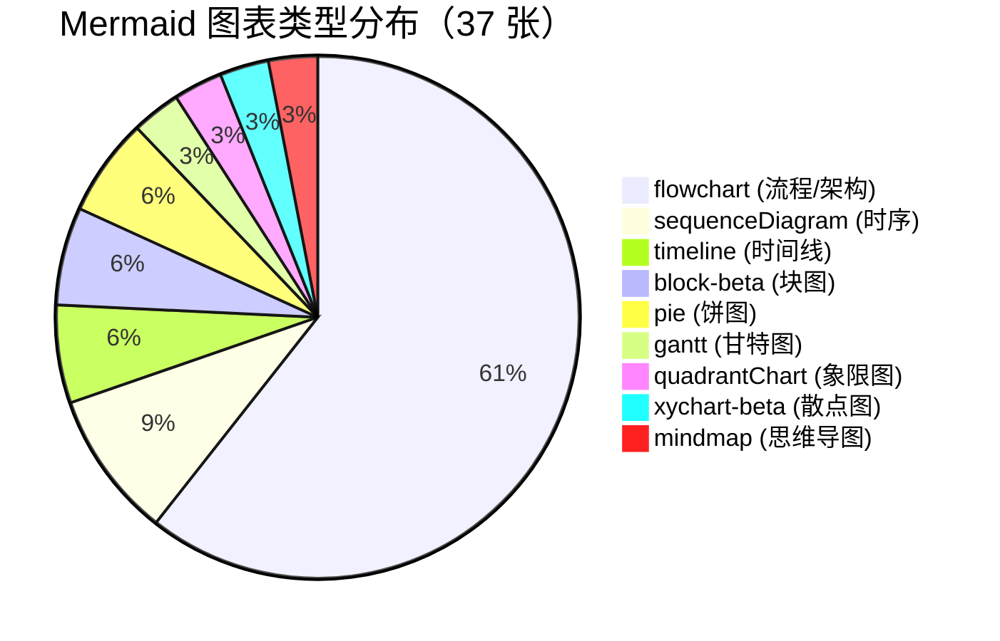

## 图表索引 (Chart Index)

> 收录报告中所有 Mermaid 图表的索引目录。按章节排序，标注图表类型和页码（PDF 版）。

| # | 章节 | 图表类型 | 标题 | 行号（源文件） |
|---|------|---------|------|---------------|
| 1 | 引言 | `timeline` | AI 编码三次范式迁移 — 关键里程碑 | ~62 |
| 2 | Ch01 需求工程 | `flowchart LR` | SDD 成熟度四阶段演进 | topic:27 |
| 3 | Ch01 需求工程 | `flowchart LR` | SDD 与传统需求工程对比 | topic:36 |
| 4 | Ch02 原型设计 | `quadrantChart` | 设计工具三圈层矩阵 | topic:16 |
| 5 | Ch03 前端开发 | `pie` | 前端 AI 工具五类用户分布 | topic:23 |
| 6 | Ch04 后端与 API | `flowchart LR` | API Contract = 真相源 — 价值锚点转移 | topic:34 |
| 7 | Ch04 后端与 API | `flowchart LR` | 无 Contract 的 AI 架构漂移 | topic:47 |
| 8 | Ch04 后端与 API | `sequenceDiagram` | API Contract-First Agent 交互流程 | topic:48 |
| 9 | Ch05 数据库 | `flowchart LR` | Text-to-SQL 基准鸿沟：Benchmark vs Production | topic:22 |
| 10 | Ch06 测试与 QA | `flowchart TB` | 环形验证 — 恶性循环 vs 良性循环 | topic:47 |
| 11 | Ch06 测试与 QA | `flowchart TB` | 形式化验证的复兴路径 | topic:65 |
| 12 | Ch06 测试与 QA | `pie` | AI 生成代码缺陷类型分布 | topic:72 |
| 13 | Ch07 CI/CD | `sequenceDiagram` | Agentic CI/CD 交互流程 | topic:31 |
| 14 | Ch08 生产运维 | `flowchart LR` | 运维自动驾驶五级模型 | topic:30 |
| 15 | Ch08 生产运维 | `flowchart LR` | AI 闭环学习运维架构 | topic:42 |
| 16 | Ch09 角色重塑 | `timeline` | Vibe Coding → Agentic Engineering 演化谱系 | topic:28 |
| 17 | Ch10 安全工程 | `flowchart LR` | Prompt Injection 攻击链 | topic:30 |
| 18 | Ch10 安全工程 | `flowchart LR` | AI 安全工具体系 | topic:47 |
| 19 | Ch10 安全工程 | `block-beta` | AI 安全四层防御体系 | topic:25 |
| 20 | Ch11 法律合规 | `gantt` | EU AI Act 分阶段执行时间线 | topic:84 |
| 21 | Ch12 横切主题 | `flowchart TB` | 2020 vs 2026 SDLC 瓶颈全局位移 | topic:19 |
| 22 | Ch12 横切主题 | `flowchart TB` | 信号体系崩溃与重建 | topic:40 |
| 23 | Ch13 Markdown 工程化 | `mindmap` | Markdown 工程化工具栈全景 | topic:41 |
| 24 | Ch14 Agent-Harness | `flowchart TB` | Harness 五层架构模型 | 141:11 |
| 25 | Ch14 Agent-Harness | `flowchart TB` | Harness 五层架构详解 | 141:31 |
| 26 | Ch14 Agent-Harness | `flowchart LR` | MCP 协议架构 | 141:86 |
| 27 | Ch14 Agent-Harness | `flowchart TB` | 权限模型层级 | 141:119 |
| 28 | Ch14 Agent-Harness | `flowchart LR` | Agent 生命周期状态图 | 145:11 |
| 29 | Ch14 Agent-Harness | `flowchart TB` | 生命周期管理流程 | 145:32 |
| 30 | Ch14 Agent-Harness | `flowchart TB` | 多 Agent 编排引擎 | 145:77 |
| 31 | Ch14 Agent-Harness | `flowchart TB` | 编排引擎详解 | 145:98 |
| 32 | Ch15 模型选型 | `xychart-beta` | 编码模型能力-成本二维定位 | 152:10 |
| 33 | Ch15 模型选型 | `flowchart LR` | 模型路由 80/15/5 架构 | 152:57 |
| 34 | Ch16 多 Agent | `block-beta` | 四种架构拓扑对比 | 161:10 |
| 35 | Ch16 多 Agent | `sequenceDiagram` | 多 Agent 冲突检测与语义合并 | 164:27 |
| 36 | Ch17 可观测性 | `flowchart TB` | Agent 可观测性三支柱全景 | 171:10 |
| 37 | Ch18 提示工程 | `flowchart TB` | 指令文件三层体系 | 183:22 |

### 图表类型分布

---

> **总计**：37 张 Mermaid 图表，覆盖 9 种类型，18 章全覆盖 | **更新日期**：2026-06-18
