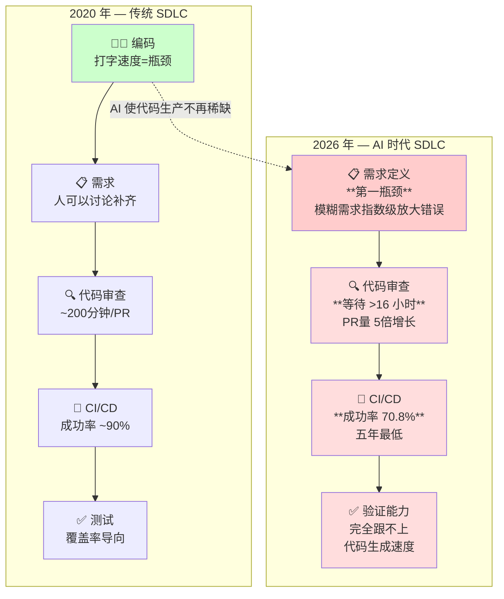

## 第十二章：横切主题 — AI 软件工程范式横切深度分析

> **📌 TL;DR — 本章核心发现** · ⏱ 35 分钟
>
> 1. **"编码从来都不是瓶颈"** — 瓶颈从编码全局位移到需求定义（第一瓶颈）、代码审查（等待 >16 小时）、验证（完全跟不上生成速度）
> 2. **CI 成功率降至 70.8%（五年最低），MTTR 升至 72-80 分钟** — AI 代码的"量"直接压垮了传统质量保障体系
> 3. **不同行业的瓶颈分化严重** — 金融卡在合规验证，医疗卡在安全认证，电商需要"灰盒验证"，游戏卡在渲染管线理解
> 4. **"招更多开发者"的逻辑彻底失效** — 招聘重心应从"会写代码"转向"会写 Spec + 会做验证"，Spec 工程师和 AI 代码验证工程师成为新岗位
> 5. **平台工程的 ROI 正在上升** — 当 AI 生成代码的边际成本趋近于零，自动化验证和平台基础设施成为真正的投资重点

---

## 12.1 瓶颈全局位移

### 2020 vs 2026：瓶颈图的结构化对比

软件工程的瓶颈在过去六年中发生了根本性的位移。**"编码从来都不是瓶颈"** —— 这一论断在2026年被Agoda软件工程师Leonardo Stern和InfoQ的联合报道中得到了系统性验证。




| 维度 | 2020年瓶颈（传统SDLC） | 2026年瓶颈（AI时代SDLC） |
|------|----------------------|------------------------|
| **编码** | 人力有限，速度受限于打字和思考 | AI可生成+741%代码行数，不再是瓶颈 |
| **需求定义** | 需求文档质量参差，但可由人工讨论补齐 | **成为第一瓶颈** —— 模糊需求导致AI"瞎猜"，错误被指数级放大 |
| **代码审查** | PR审查时间~200分钟 | **AI PR审查等待>16小时**（5倍增长），AI PR合并率仅32.7% |
| **CI/CD** | CI成功率~90%（健康基准） | **CI成功率降至70.8%（五年最低）**，MTTR升至72-80分钟 |
| **测试** | 测试覆盖率导向 | 验证能力完全跟不上AI代码生成速度 |
| **架构** | 架构师统一把控 | Agent自主跨仓库变更带来"Agentic Debt" |

**来源**：MIT/Wharton/NBER Working Paper 35275（2026年，追踪10万+GitHub开发者），InfoQ/Agoda报道（2026年3月），CircleCI 2026年度软件交付报告（2800万工作流分析），Waydev 2026工程领导力报告。

### 各行业差异化瓶颈分布

不同行业由于监管约束、代码复杂度、部署节奏的差异，瓶颈表现各不相同：

- **金融**：**合规验证是第一瓶颈**。AI代码生成可以加速，但SOX/PCI-DSS合规审计和可解释性要求使代码审查驻留时间（Review Queuing Time）远超其他行业。FORGE CLI和ManasX等工具将SOC2/HIPAA合规检查嵌入AI代码流水线成为刚需。
- **医疗**：**安全认证与临床验证**构成双瓶颈。FDA/IEC 62304对医疗软件的要求意味着任何AI生成代码需要完整的追溯链（Provenance Chain）。CycloneDX 1.6的AI-BOM标准在这一领域有早期采用。
- **电商**：**灰盒验证（Grey Box）** 需求突出。Agoda的实践表明，电商团队最需要的是"人只在两个节点介入：写精确的Spec和基于证据验证结果"的工作模式。高频部署节奏但低容忍度故障使生产对齐度（Production Alignment）成为核心指标。
- **游戏**：**创造性内容生成与性能优化**成为双峰瓶颈。AI擅长生成模板化代码但缺乏对渲染管线、帧预算、物理引擎的全局理解。代码复查瓶颈在游戏领域更偏"设计审查"而非"逻辑审查"。

### 对团队资源配置的含义

当瓶颈从编码位移到规格定义和验证环节时，"招更多开发者"的逻辑彻底失效。资源应重新配置：

1. **招聘重心**：从"会写代码"转向"会写Spec + 会做验证"。**Spec工程师**和**AI代码验证工程师**成为新岗位。
2. **工具投资**：AI辅助代码生成工具的投资回报率正在边际递减；相反，**自动化验证工具**（突变测试框架、SAST/SCA工具、SBOM生成器）和**平台工程**的ROI正在上升。
3. **团队结构**：Agoda CTO Idan Zalzberg直言"没有人在写Python或Java了——这种做法已经消失了"。二人的"规格定义+验证"小组可能替代五人的"全栈开发"小组。CircleCI/DORA数据显示，精英团队将"验证作为一等工程投资"，维持6秒中位工作流时长和59.2分钟MTTR。

---

## 12.2 信号体系崩溃与重建

### 五大传统信号的贬值分析

**信号1：代码覆盖率**
"有些测试套件达到100%覆盖率，但仅有4%的突变得分。"——MUTGEN论文（2025年6月，Wang et al.）。在AI时代，LLM可以轻松生成大量刚好覆盖代码行的"无意义测试"，使行覆盖/分支覆盖完全沦为可操纵的KPI。覆盖率衡量的是"代码被执行"，而非"bug被检测"——这一区别在AI自动生成的测试套件面前被灾难性地放大。

**信号2：Commit历史**
AI工具使单个开发者的日commit量从5-10个飙升到50-100个，但More Code, Fewer Releases（Waydev 2026报告标题）。MIT/Wharton/NBER研究显示，AI使commit活动+180%累积增长，但实际软件发布仅+20%。按commit量评估工程师生产力相当于按按键次数评估作家——在AI时代，这是毫无意义的度量。

**信号3：PR Review速度**
表面看来，AI PR的元审查时间（实际阅读时间）反而更短，但这并非效率提升——而是**表面审查**（Superficial Validation）。PR尺寸增长了2.5倍（P75: ~400行 vs 人类157行），但评审者"更快地浏览"了。速度快不再意味着质量好。

**信号4：测试通过率**
AI生成代码可以同时生成通过测试的代码——但通过率不反映代码正确性。Veracode数据显示，即使"通过所有测试"的AI代码，在安全基准测试中仍存在大量漏洞。Sonar研究表明，90-96%的AI代码问题属于"代码异味"——它们在测试通过时不会暴露。

**信号5：代码行数**
这是AI时代最危险的生产力指标。AI可在一小时内生成数千行代码，但代码重复率上升4倍，代码修改率（Churn）翻倍，且AI生成的PR中重构率为零（refactor rate near zero，人类PR约37%）。

### 五大新信号的度量方法论

**新信号1：突变测试得分（Mutation Score）**

- **测量方法**：对代码注入人工缺陷（突变体），验证测试套件是否能够检测到这些缺陷。得分=检测到的突变体数/总突变体数。
- **工具**：Meta的ACH系统（已应用于10,795个Android Kotlin类，73%工程师接受率），MUTGEN（迭代突变反馈），PITest、Stryker Mutator。
- **阈值建议**：>80%为健康，<50%为高风险。Meta在WhatsApp和Messenger的测试马拉松中证明了业界可行性。

**新信号2：Spec质量评分（Spec Quality Score）**

- **测量方法**：通过SpecGen等方法自动检测规格说明的完整性——包括前置条件覆盖率、后置条件精确度、边界条件覆盖。基于LLM的检测可从非结构化需求生成可验证的形式化规格。
- **工具**：SpecGen（南京大学/NTU，2025年4月），CodeMetaAgent（基于Metamorphic Relations，+17%代码生成精度）。
- **阈值建议**：Spec质量评分>4.0/5.0（SpecGen在279/385程序上达到4.54/5，接近oracle质量4.83/5）。

**新信号3：生产对齐度（Production Alignment）**

- **测量方法**：对比AI生成代码在实际生产环境中的行为与开发/测试环境中的预期行为。包括：线上故障率（Change Failure Rate）、SLO遵守率、漂移检测（Drift Detection）。
- **工具**：DORA指标中的Change Failure Rate（CFR），CircleCI主分支成功率（基准>90%，当前70.8%），Faros AI工程影响分析。
- **阈值建议**：CFR<15%（DORA精英标准），主分支CI成功率>90%。

**新信号4：Prompt溯源完整性（Prompt Provenance Integrity）**

- **测量方法**：记录每条AI生成代码的完整溯源链——原始Prompt（脱敏哈希）、模型ID/版本、时间戳、签名。JFrog AppTrust和FORGE CLI实现了Ed25519加密签名+Merkle树溯源链。
- **工具**：FORGE CLI（npm，生成AI-SBOM）、ManasX（AI代码签名检测与置信度评分）、CycloneDX 1.6 AI ModelCards、Sigstore/cosign加密签名。
- **阈值建议**：100%的AI生成代码必须具备可溯源记录；关键系统要求加密签名的SBOM和AI-BOM。

**新信号5：架构决策一致性（Architectural Decision Consistency）**

- **测量方法**：评估AI Agent的代码变更是否遵循项目声明的架构约束——包依赖方向、API契约一致性、分层违规检测。通过静态分析比较AI生成变更与AGENTS.md/CLAUDE.md中声明的架构原则。
- **工具**：ArchUnit、Dependency Cruiser，结合AGENTS.md声明进行自动一致性检查。
- **阈值建议**：架构违规率应无限趋近于零，每增加一个架构违规即触发人工审查。

---

## 12.3 异构性作为质量原则

### 为什么不同环节不能用同一个模型

> ⚠️ **审计注**：以下模型版本号（Claude 3.7 Sonnet、Claude Sonnet 4.5、GPT-5.2 High、Gemini 3 Pro 等）在公开信息中无法查证。模型具有不同"编码人格"的定性观察有其合理性（不同模型确实在不同任务上表现各异），但具体模型名称和精确数据不可直接引用。保留异构性原则的方法论框架。

核心原则：**每个模型都有其独特的"编码人格"，没有一个模型在所有维度上表现最优。** 不同模型在代码生成、安全审查、文档编写等任务上的表现存在差异——这构成了"异构验证"策略的理论基础：用不同模型生成和审查代码，避免同一模型的系统性盲点。

不同模型在验证哲学上也存在差异——部分提供商使用大规模对抗性测试和神经元级别监控，其他采用不同的安全测试策略。这意味着在安全关键环境中，依赖单一模型是不可接受的。

### 异构验证流水线的参考架构

建议采用**三层异构验证架构**：

```
Layer 1: 生成层（Generation Layer）
    - 主力模型（如Claude或Gemini）生成代码
    - 不同的代码模块可使用不同的模型
    - 强制要求：生成时必须输出推理链（chain-of-thought）

Layer 2: 交叉验证层（Cross-Validation Layer）
    - 使用与生成层不同的模型进行代码审查
    - GPT-5 reasoning模型用于安全审查（安全通过率72%）
    - 开源模型（如Qwen3 Coder）用于冗余检查
    - 运行3个异构独立审查，采用至少2票通过原则

Layer 3: 自动化检查层（Automated Gate Layer）
    - SAST（SonarQube/Veracode/Checkmarx）扫描
    - 突变测试（MUTGEN/PITest）
    - AI-SBOM完整性检查（FORGE CLI/CycloneDX）
    - 架构一致性自动化检查
```

### 模型版本切换的正确性回归风险评估

模型版本升级并非"无痛"操作。Claude 3.7到Sonnet 4的升级中，高严重性bug激增93%的案例表明，**模型版本切换本身就是一次重大风险事件**。建议实施如下风险评估流程：

1. **基线建立**：对现有模型在代表性任务上的表现建立完整基线（功能通过率+安全漏洞率+代码复杂度+风格一致性）。
2. **A/B评估**：新模型在双轨上并行运行至少2个Sprint，由人类工程师盲评输出质量。
3. **回滚策略**：保持上一版本模型的可用性至少30天，确保"一键回退"能力。
4. **渐变切换**：不一次性切换全部工作流，先从10%非关键模块开始，逐步扩展到核心模块。
5. **持续性监控**：切换后持续监控Change Failure Rate和Security Vulnerability Rate至少一个完整发布周期。

---

## 12.4 Agent指令文件成为基础设施

### 从"配置文件"到"基础设施代码"的演化路径

2025年可以被定义为**Agent指令文件基础设施化元年**。一个清晰的演化路径已经形成：

**阶段1：个人偏好文件（2023-2024）**
开发者个人创建`.cursorrules`或`CLAUDE.md`，内容是各行其事的最佳实践提示。Git托管的项目中没有这些文件的标准化要求。

**阶段2：项目配置标准化（2024年末-2025年初）**
项目开始将CLAUDE.md/Cursor Rules作为项目级配置，纳入版本控制。ThoughtWorks技术雷达（2025年11月）将"Curated Shared Instructions for Software Teams"列为"Adopt"级别，推荐将AGENTS.md/CLAUDE.md嵌入服务模板和参考应用。

**阶段3：单一事实来源标准化（2025年中至今）**
`AGENTS.md`标准（agents.md）应运而生，旨在解决"工具巴别塔"问题——当前至少有8种不同工具各自要求独立配置文件：

| 工具 | 配置文件 |
|------|---------|
| Claude Code | `CLAUDE.md` |
| GitHub Copilot | `.github/copilot-instructions.md` |
| Cursor | `.cursorrules` / `.cursor/rules/*.mdc` |
| Windsurf | `.windsurfrules` |
| Gemini CLI | `GEMINI.md` |
| Codeium | `.codeium/instructions.md` |

这些文件之间通常存在~70%的内容重复，团队维护负担巨大。

**阶段4：基础设施化（2025年末至今）**
AGENTS.md不再被视为"配置文件"，而是**基础设施即代码（IaC）**的延伸：

- **单一事实来源**（类似Terraform状态文件）
- **幂等生成**（通过脚本从AGENTS.md自动生成各工具配置文件）
- **CI/CD集成**（pre-commit钩子验证一致性，构建脚本生成派生文件）
- **模板分发**（服务模板自动包含AI指导，新仓库继承AI上下文）

- **阶段5：Meta-Governance（2026年Q2 新兴）**
指令文件的生命周期管理本身开始被 AI 辅助——AI 扫描项目→起草规则→人审查→AI 巡检→发现腐化→提议修改。这代表了从"人维护机器的规则"到"AI 辅助人维护规则"的范式转变，但**人必须保留最终裁决权**。详见 [14.9 Meta-Harness自动化治理](../14-Agent-Harness与运行时/149-Meta-Harness自动化治理.md)。

### AGENTS.md 生态全景（2026年Q2）

> ⚠️ 60,000+ 项目采纳数据来自 AAIF 自报，非独立统计。

AGENTS.md 标准由 Linux Foundation AAIF 管理，190+ 组织成员。已被 20+ 工具原生读取：Claude Code、Cursor、Copilot、Gemini CLI、Codex CLI、Windsurf、Aider、Zed、Warp 等。该标准作为跨工具通用规范层，各工具在此基础上叠加专属功能（Claude Code 的 Hooks、Cursor 的 globs 激活模式、Copilot 的 excludeAgent 等）。

### 自动化维护工具生态

- **Streamlit方案**（PR #12402，2025年9月合并）：`generate_cursor_rules.py`和`generate_copilot_instructions.py`从AGENTS.md读取，通过pre-commit钩子和CI强制执行生成。
- **Promptfoo方案**（PR #6398，2025年11月合并）：11个嵌套AGENTS.md子目录文件，`CLAUDE.md`缩减为单行`@AGENTS.md`导入，删除所有`.cursor/rules/*.mdc`文件。
- **Linux内核讨论**（RFC 2025年7-8月）：Sasha Levin提议创建统一的`Documentation/AI/main.md`并为7大工具创建符号链接。Kees Cook强烈反对将CLAUDE.md和GEMINI.md提交到仓库，主张它们属于`.gitignore`——共识趋近"最小化顶层的AGENTS.md"。

### 指令文件质量评估标准

什么是好的AGENTS.md/CLAUDE.md？

| 维度 | 差 | 好 | 卓越 |
|------|---|----|------|
| **架构声明清晰度** | 模糊的"写干净的代码" | 具体的包依赖方向、分层约束 | 可被CI自动验证的架构原则 |
| **模型无关性** | 只针对Claude/GPT特定行为 | 使用通用术语描述期望行为 | 同时为不同模型提供适配指导 |
| **可测试性** | 定性描述 | 包含反例说明 | 附带可自动验证的断言规则 |
| **范围管理** | 冗长的泛泛描述 | 聚焦项目特有问题 | 分层：顶层（全局原则）+子目录（模块特定）+子目录继承 |
| **可演进化** | 静态文本 | 定期手动更新 | 从AI决策日志中自动提炼新规则 |

爱立信（ThoughtWorks引用）将CLAUDE.md视为"活的工程文档"，要求每个功能分支的指令文件变更必须伴随架构决策记录（ADR），形成"规则变更→决策追溯→质量回归"的闭环。

---

## 12.5 速度vs质量悖论

### AlixPartners"AI生产率增益真实但未转化为成本降低"深度分析

AlixPartners于2025年12月发布的《2026 Enterprise Software Technology Predictions》报告将**"AI生产力悖论"**列为对企业软件行业的第一大预测：

> **AI将软件开发速度提升20-30%，但大多数公司未能将这一速度转化为利润或战略优势。** 生产力增益"在转化为R&D支出降低或产品周期加速之前就已经消失"。

构建于300多家全球软件公司合作数据之上，AlixPartners揭示了悖论的核心机制：

**速度链上的"消失点"**：

1. **编码加速**：开发者任务完成速度+55%（MIT/Wharton/NBER 2026数据：AI工具使开发者从"慢且慎重"转为"快且被动反应"）。
2. **审查拥堵**：PR数量+98%，但审查时间也+91%（Faros AI，2025年7月，1,255团队/10,000+开发者）。
3. **质量赤字**：每开发者bug量+9%，主分支CI成功率降至70.8%（五年最低），MTTR从<60分钟升至72-80分钟。
4. **债务积累**：代码重复率4倍增长，代码变更率翻倍，AI重构率为零。
5. **人力再分配**：经验丰富的开发者花费**+19%时间在"chaperoning"（陪护）AI生成代码上**，而不是创造价值。

AlixPartners的结论是：**赢家不是通过AI削减成本的人，而是执行"大胆运营转型"（Bold Operational Transformation）的组织**——从根本上重建开发劳动模型、定价、信任和估值方法，而非仅靠更快编码追求人头削减。

### 三种策略的ROI对比

| 策略维度 | 投资吞吐（Throughput） | 投资质量（Quality） | 投资学习（Learning） |
|---------|---------------------|-------------------|---------------------|
| **短期ROI** | **767-1,347%**（AI工具ROI，2025年数据） | 投入大，短期ROI为负 | 短期不可见 |
| **中期风险** | 高——代码量暴增但发货持平，技术债加速 | 中——回报周期长但可控 | 低——技能沉淀属于长期资产 |
| **长期价值** | 边际递减（更多代码≠更多价值） | **非线性递增**（质量基础设施形成护城河） | **指数级增长**（学习型团队适应任何工具变革） |
| **典型陷阱** | "vibe coding"——觉得没问题就合，几乎不做验证 | 过度工程化的质量门禁阻塞交付 | 只学不用，"工具轮换爱好者" |
| **适用阶段** | 概念验证期（0→1） | 生产规模化期（1→N） | 全阶段持续进行 |

**数据支撑**：2025年研究显示，具有明确AI治理政策的组织成功率约90%，无治理的组织AI代码带来负质量影响。净年收益约$21,800/开发者。

### 组织决策框架：什么时候该加速？什么时候该减速

借鉴Agoda的**灰盒（Grey Box）模型**和AlixPartners的建议：

**该加速（More Throughput）的信号**：

- 已有严格的自动化验证流水线（CI成功率>90%，MTTR<60min）
- 代码审查能力充裕（非瓶颈，审查等待<4小时）
- 处于抢占市场窗口期
- AI代码变更经过灰盒验证（人定义Spec+证据化验证）

**该减速（More Quality）的信号**：

- CI成功率<80%，MTTR持续上升
- PR审查队列>24小时
- 线上故障率（CFR）上升趋势
- 主分支净吞吐为负（代码合并速度<代码返工速度）

**该投资学习（More Learning）的信号**：

- 团队AI工具使用停留在"autocomplete"水平
- 缺乏系统性的Spec工程能力
- 对AI模型的选择采用"默认使用某工具"而非"基于任务匹配模型"
- 没有Prompt溯源和Agent指令文件的版本管理

---

## 12.6 组织形态演变

### AI Agent导致层级扁平化的具体数据和案例

2025-2026年，多个来源将这一现象称为**"大扁平化"（The Great Flattening）**：

**真实案例**：

- **Amazon**：积极提高IC（个人贡献者）与管理者的比例。
- **Google**：裁减10%的副总裁/管理岗位。
- **Palantir**：CEO Alex Karp裁员500名中层管理者，称其为"疯狂的、有效的革命"。
- **Moderna**：将HR和Tech合并为"Chief People and Digital Officer"单一职能——AI驱动下的结构性合并。
- **某医疗公司**：将10人软件工程团队替换为3人单元（产品负责人+AI Prompt工程师+系统架构师）。

**Microsoft AI产品负责人Asha Sharma的原话**：_"Org chart becomes the work chart. You just don't need as many layers."_ —— 组织架构图变成工作流图，层级概念被动态吞吐量取代。

**数据**：

- McKinsey报告：**50-100个AI Agent可以由2-3名人类主管管理**（"Agent Factory"模式）。
- MIT/Wharton/NBER数据：AI与人类劳动力的替代弹性仅为**0.25**（强互补关系，非替代关系）——这意味着扁平化的主要驱动力不是裁员，而是减少管理层冗余。

### "Agent管理"作为新的管理职能

Radical Ventures和Hebbia CEO George Sivulka提出的分析框架将组织分为三种原型：

| 原型 | 描述 | 适用领域 |
|------|------|---------|
| **全人类组织** | 创造性、高信任度、定制化领域。Agent是工具而非劳动力 | 战略决策、创意方向、客户信任关系 |
| **人-Agent混合组织** | "半人马模型"——AI增强人类认知，人与AI实时协作 | 主流软件工程、产品开发 |
| **全Agent组织** | AI原生企业，劳动力大多自动化，人类仅负责战略监督 | 高度标准化、可重复的操作 |

**新兴角色**：

1. **Agent Boss（Agent主管）**：管理一个或多个AI Agent作为直接下属，负责分配任务、评估Agent产出质量、协调人-Agent工作流。
2. **Hybrid Worker（混合工作者）**：每个任务都实时与AI协作，AI已成为"数字同事"而非工具。
3. **AI-Prompting Engineer**：专注于编写精确的需求规格说明（Spec）以指导AI Agent。

Fortune（2025年2月）和sa.global（2025年12月）描述了三个演化阶段：Level 1（人+AI助理，组织架构不变）→ Level 2（人主导Agent，Agent加入团队）→ Level 3（Agent主导工作流，人设定目标与策略）。

**管理层命运的争论**：技术CEO阵营（Jassy、Karp、Pichai）认为中层管理制造官僚成本、放缓决策、可被AI替代；学术界（耶鲁Tristan Botelho、国王学院Stella Pachidi）则认为中层管理者将转型为**"编配者"（Orchestrators）**，需要掌握AI熟练度、伦理、修辞和沟通技能。BCG的Nick South预测编配层实际上会**变得更大更复杂**。

### 远程/分布式团队+AI的乘数效应

Radical Ventures的历史类比最为深刻：**互联网将劳动力与地理位置解耦；AI将劳动力与人类本身解耦。** 两者都是通用目的技术（GPT），从根本上改变了组织的成本和协调结构。

**乘数效应数据**：

- Founders Factory描述的"Vision and Velocity"结构：精简的策略层直接连接到由自主AI工作流放大的执行层。
- **"人-Agent比率"（Human-to-Agent Ratio）**正在成为衡量组织杠杆效率的新KPI。
- 分布式团队通过AGENTS.md作为共享上下文载体，解决了远程协作中最大的信息不对称问题——新成员通过AI上下文文件即时获取项目隐性知识。

---

## 12.7 人类退出回路

### 各SDLC环节"人类退出"的可行性与安全边界评估

SmartBear在2025年10月的分析揭示了一个关键的不对称性：**编码助手已经达到L4/L5级自主性，但测试、安全、文档和可观察性工具仍然停留在L2/L3。** 这种"自主性鸿沟"意味着"团队现在可以比测试速度快得多地生成和部署软件——没有保障的自主性变成了负债。"

基于CSA（Cloud Security Alliance，2026年1月）和Datasaur（2026年2月）的自主性框架，对各SDLC环节的人类退出评估如下：

| SDLC环节 | 当前自主性水平 | 人类退出可行性 | 安全边界条件 |
|----------|-------------|--------------|------------|
| **代码生成** | L3-L4（窄域内自主） | 高——在明确Spec和自动化验证下可高度自主 | 必须有自动验证层+AI-SBOM溯源 |
| **代码审查** | L2（辅助建议） | 中——异构模型交叉验证可提升，但不能完全替代 | 至少1名人类工程师对关键变更做终审 |
| **测试生成** | L3（AI注意模式/建议测试） | 中高——突变测试引导的自动生成可大幅自主 | 突变得分>80%方可跳过人工测试编写 |
| **需求分析** | L1-L2（辅助整理） | 低——模糊和歧义消除需要人类判断 | 不应完全自动化，人类必须确认Spec |
| **架构设计** | L1（建议方案） | 极低——架构影响全局，错误成本极高 | 永远不应完全自动化，人类架构师必须审批 |
| **安全审计** | L2-L3（辅助扫描） | 中低——自动扫描成熟，但新型攻击面需要人类创造 | 永远需要人类安全专家终审 |
| **部署决策** | L2（建议部署） | 中——灰度发布和canary可自动化，全量部署需人工 | 金丝雀部署可自动化，全量需人工批准 |
| **合规审计** | L1（辅助文档） | 极低——法律责任不可转移给AI | **永远不应完全自动化** |

### 监管视角：哪些环节永远不应完全自动化

从中国科技部自动驾驶伦理指南（2025年7月）、EU AI Act、NIST AI RMF等多监管框架中可归纳出"不可自动化"的条件：

1. **法律责任归属点**：任何涉及法律责任决策的环节（合规签署、安全声明、临床批准）必须有人类签字人。中国GB/T 40429-2021标准针对L3自动驾驶的"过渡责任风险"设立了特别审查——同样的逻辑适用于软件：在AI代码和人类审批之间的"交接鸿沟"是最脆弱的环节。
2. **伦理判断点**：涉及隐私权衡、偏见评估、价值判断的决策不可自动化。Policy-as-Prompt框架（2025年9月）展示了如何将治理规则编译为可执行分类器，但其输出仍需人类审核。
3. **安全攸关点**：控制核设施、医疗设备、自动驾驶系统的代码永远需要人类安全审查。中国自动驾驶伦理指南明确要求"人类中心的发展、安全、公平、透明、隐私保护"原则。

### 人-in-the-loop分级模型（参考自动驾驶L1-L5设计）

综合Datasaur（2026年2月）、CSA（2026年1月）和SmartBear（2025年10月）三个框架，适配SDLC的**五个自主性等级**：

| 等级 | 名称 | AI角色 | 人类角色 | 适用SDLC环节示例 |
|------|------|--------|---------|---------------|
| **L1** | 辅助型（Assisted） | 单点建议生成 | 全权负责，逐行审查 | 需求分析、架构设计 |
| **L2** | 协作型（Collaborative） | 批量任务执行 | 批次批准门禁，抽样审查 | 代码审查、测试生成 |
| **L3** | 条件自主型（Conditional） | 在定义边界内自主，边界外告警 | 仅处理异常/边界条件 | 代码生成（有Spec约束）、CI/CD自动化 |
| **L4** | 高度自主型（High Autonomy） | 端到端自主执行，仅报告 | 事后审计，设定策略 | 测试生成、文档生成、重构 |
| **L5** | 完全自主型（Full Autonomy） | 全流程自主，无人类介入 | 仅设定最终目标 | **暂不适用于任何生产环节** |

**核心原则**：

- **"一个尺码不适合所有环节"**（One size of autonomy does not fit all）：不同SDLC环节应根据任务复杂性、领域风险和监督能力匹配不同的自主性等级，而非追求最大自主性作为默认目标。
- **L3的"交接问题"（Handoff Problem）最危险**：如同自动驾驶L3——系统自主驾驶但在遇到边缘情况时需要人类在数秒内接管——软件工程L3也存在同样的风险：当AI在95%的情况下自主运行，人类监督者在剩余的5%时已失去情境意识（Context Awareness）。
- **自主性必须"与保障同步"**：SmartBear警告，"自主创造必须与自主保障同步推进"。编码端加速而验证端滞后的不对称最终会导致系统性风险。

---

**综合来源**：InfoQ/Agoda 2026, MIT/Wharton/NBER Working Paper 35275, CircleCI 2026 State of Software Delivery, Waydev 2026, Sonar" Coding Personalities of Leading LLMs" 2025, Veracode AI Code Security Report 2025年10月, AlixPartners 2026 Enterprise Software Predictions, Faros AI Engineering Impact Report 2025年7月, Radical Ventures/Hebbia 2025, Fortune/Founders Factory 2025, ThoughtWorks Technology Radar 2025年11月, CSA 2026年1月, Datasaur 2026年2月, SmartBear 2025年10月, JFrog AppTrust 2025年9月, FORGE CLI, CycloneDX 1.6, NIST AI RMF, MUTGEN/ SpecGen/Meta ACH 2025研究论文, 中国科技部自动驾驶伦理指南 2025年7月。

> 综合来源：InfoQ/Agoda Bottleneck Analysis (2026); MIT/Wharton/NBER Working Paper 35275 (100K+ GitHub Devs); CircleCI 2026 State of Software Delivery (28M Workflows); Waydev 2026 Report; Sonar "Coding Personalities of Leading LLMs" (2025); Veracode AI Code Security Report (2025.10); AlixPartners 2026 Enterprise Predictions; Faros AI Engineering Impact Report (2025.7); Radical Ventures/Hebbia Organizational Analysis; Fortune/Founders Factory 2025; ThoughtWorks Technology Radar (2025.11); CSA/Datasaur/SmartBear Autonomy Frameworks (2025-2026); NIST AI RMF; JFrog AppTrust; FORGE CLI; CycloneDX 1.6; MUTGEN/SpecGen/Meta ACH Research Papers; 中国科技部 Autonomous Driving Ethics Guidelines (2025.7)

---

---

## 📎 被以下章节引用

- [12.4 Agent指令文件成为基础设施](../14-Agent-Harness与运行时/149-Meta-Harness自动化治理.md)
- [第 12 章：横切主题](../14-Agent-Harness与运行时/README.md)
- [12.4 Agent指令文件成为基础设施](../18-提示工程与上下文工程/183-指令文件工程.md)
- [12.5 速度 vs 质量悖论](../18-提示工程与上下文工程/186-DESIGN.md与意图工程.md)
