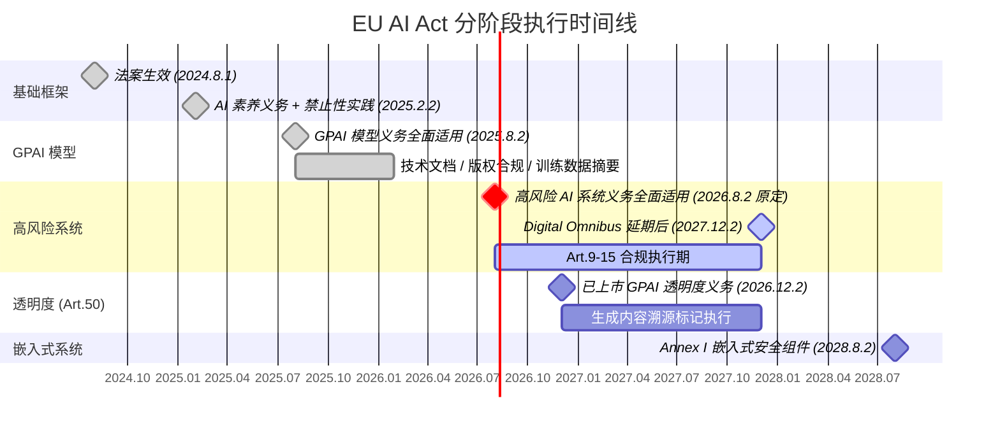

## 第十一章：法律合规与知识产权 — AI 代码的法律边界

> **📌 TL;DR — 本章核心发现** · ⏱ 10 分钟（全章深读）
>
> 1. **Copilot 诉讼案 DMCA 索赔已被驳回，但违约和许可证索赔仍在审理** — 法院要求"逐字相同"（verbatim copying）作为侵权门槛，仅"实质性相似"不足以支持 DMCA 索赔
> 2. **GPL/AGPL "许可证污染"是真实的工程风险** — 传统 SCA 工具依赖包清单扫描，无法检测 AI 生成的片段级代码输入，许可证污染可在完全不触发告警的情况下发生
> 3. **检测工具已涌现但覆盖不全** — Black Duck Snippet API、SCANOSS、Codacy Guardrails、CodeGenLink 提供片段级溯源，但对抗性逃逸仍在军备竞赛中
> 4. **EU AI Act 和 FDA 对 AI 代码的可追溯性要求** — 企业需要建立代码溯源机制（哪个工具、哪个时间、哪个 Prompt），审计日志将成为合规的关键证据

### 摘要

AI 生成代码的法律地位正在快速演变。GPL 污染、版权归属、欧盟 AI Act 合规、责任分配——这些问题从"未来风险"变为"当前工程约束"。

---

## 11.1 AI 代码的版权与许可

### 11.1.1 GitHub Copilot 诉讼案的最新进展

**案件概况**：_Doe 1 et al. v. GitHub Inc. et al._（案号 4:22-cv-06823，北加州联邦地区法院）是全球首起针对 AI 代码生成工具训练数据版权的大型集体诉讼。原告（匿名开源程序员，由 Matthew Butterick 律师代理）于 2022 年 11 月起对微软、GitHub 和 OpenAI 提起 22 项索赔，寻求 10 亿美元以上赔偿，核心指控是 Copilot 在训练中使用公共代码库时剥离了版权管理信息（CMI），违反 DMCA 第 1202(b)条和开源许可证。截至 2026 年，案件经历多轮裁决：2024 年 1 月 Jon S. Tigar 法官驳回大部分 DMCA 索赔；2024 年 7 月 5 日（裁定解封日）以"偏见"为由终局性驳回 DMCA 第 1202(b)条索赔、惩罚性赔偿和不当得利索赔。法官指出原告未能举出**任何一个**Copilot 生成与受版权保护的代码完全相同的示例——这是 DMCA 索赔成立的必要条件。**仅两项索赔存活**：违约和开源许可证违规。2024 年 7 月 27 日，原告自愿撤销对 OpenAI 的所有指控，仅剩 GitHub 和微软作为被吿。截至 2026 年 2 月，第九巡回上诉法院已进行口头辩论，判决待出。

**工程启示**：

1. **完全相同的代码（verbatim copying）是诉讼的硬门槛**——如果 AI 输出仅与训练数据"实质性相似"（substantially similar）而非完全相同，DMCA 索赔极难成立。但"实质性相似"仍可触发常规版权侵权和许可证违约索赔。
2. **许可证合规风险并未消除**——DMCA 索赔虽被驳回，但违约与许可证索赔仍在审理中。这意味着即使 Copilot 输出代码不构成 DMCA 违规，若其输出源自 GPL/AGPL 等 copyleft 许可的训练数据且未履行许可证义务，GitHub 和微软仍可能承担责任。Copilot 的"代码引用过滤器"（duplicate detection filter）仅阻止逐字匹配，但无法防护许可证义务层面的风险。
3. **企业使用 AI 代码工具应建立代码溯源机制**——记录哪些代码片段由 AI 生成、来自哪个工具、在哪个时间点产生。当诉讼发生时，这份审计日志将成为证明企业已尽合理注意义务的关键证据。

**数据点**：Copilot 在 1%情况下可能生成 150 字符以上的训练数据逐字匹配——但问题是这 1%匹配的是"某个人的"代码，而非特定原告的代码。这正是法院驳回 DMCA 索赔的逻辑核心。

---

### 11.1.2 GPL/AGPL 许可证污染

**核心问题**：GPL 和 AGPL 是"病毒式"copyleft 许可证——即使只使用一小部分受此类许可证保护的代码，整个衍生作品也可能需要以相同许可证开源。当 AI 编程助手在 copyleft 代码上训练后生成与训练数据结构性相似的代码片段时，若开发者将其纳入专有软件，理论上整个代码库可能被"污染"为 GPL/AGPL。

**已知案例与执法动态**：软件自由保护组织（Software Freedom Conservancy, SFC）于 2023 年 10 月向美国版权局提交正式意见，将生成式 AI 系统称为"版权洗衣机"（Copyright Washing Machine），指控其吸收 TB 级 copyleft 代码后输出剥离了许可证义务的材料。SFC 在 2023 年 12 月进一步点名微软，指控 Copilot 被编程为**主动剥离 GPL 许可声明**——即 AI 本身"想要"输出 GPL 声明但被系统拦截。SFC 还披露其持有 Copilot 训练集中 copyleft 作品的版权，而微软拒绝讨论可能的侵权问题。在实际执法层面，SFC 曾成功追诉 Vizio 和 BusyBox 的 GPL 违规案（_Software Freedom Conservancy v. Vizio_，2021 年立案，持续审理中），为 AI 时代的 GPL 执法奠定了先例基础。

**检测工具**（2024-2025 年涌现）：

- **Black Duck Snippet API**（Synopsys）：代码片段级指纹识别，对拍字节级知识库进行匹配，可返回许可证类型（如 RECIPROCAL 代表 GPL），支持在代码生成时通过 GitHub Actions 集成，20-50 行片段约 2 秒响应。
- **SCANOSS + Theia IDE 集成**（2025 年 3 月）：开源、免费的片段扫描服务，直接嵌入 Theia AI 框架，显示匹配百分比、源仓库和许可证信息。
- **Codacy Guardrails**（2025 年）：IDE 内实时的 GPL 相似性检测，适用于 VS Code、IntelliJ、Cursor、Windsurf（通过 MCP 服务器），在 commit 前标记警告。实测在 AI 生成的 WordPress 集成代码中捕获了 5 个 GPL 许可相似性警告。
- **CodeGenLink**（ASE 2025 学术工具）：GitHub Copilot 扩展，结合 LLM 网页搜索能力，查找生成代码的可能来源及许可证。

**传统 SCA 工具的盲区**：传统软件组成分析（SCA）依赖包清单（`package.json`、`pom.xml`）扫描，无法检测 AI 生成的片段级代码输入——它们不声明依赖，不引入包，通过复制粘贴进入代码库。这使得许可证污染可以在完全不触发告警的情况下发生。

**工程最佳实践**：

1. 将许可证扫描"左移"至代码建议阶段（IDE 层），而非仅在发布时扫描。
2. 使用片段级分析而非仅包级 SCA。
3. 设置许可策略——在 GPL/AGPL 匹配代码进入`main`分支前自动阻断或标记。
4. 维护审计追踪——记录 AI 生成贡献的溯源数据。

---

### 11.1.3 主要开源项目对 AI 贡献的接受政策

**Linux 内核**（2025 年）：

- 2025 年 7 月：NVIDIA 内核开发者 Sasha Levin 提交 RFC 补丁，提议为 Linux 内核开发中的 AI 编码助手（Claude、Copilot、Cursor、Codeium、Windsurf、Aider 等）建立统一配置和正式规范。
- 2025 年 12 月维护者峰会：Linus Torvalds 参与讨论。核心政策方向为：**允许使用，但人工问责制不可动摇**——纯机器生成的补丁（未经人工审查）不被接受。AI 助手使用`Co-developed-by:`标签标识自身，但**不能使用`Signed-off-by:`**（该标签保留给承担法律责任的开发者）。鼓励披露 AI 使用但不强制统一格式。Torvalds 主张"将 AI 视为普通工具"，先实验再定规则。
- **例外**：Linux man-pages 项目采取**严格禁止**政策，援引版权（AI 无法执行 DCO）、质量（AI 生成的文档可能不准确）和伦理三方面担忧。

**Apache 基金会**：2025 年更新了 IP 政策以专门针对 AI 生成的贡献。具体项目如 Apache DataFusion 允许 AI 代码但要求标注、提供单元测试/benchmark 证明、再现步骤及许可证兼容说明。

**CNCF/Kubernetes**：建议旗下项目制定明确 AI 贡献政策。Kubernetes 实际执行政策：允许 AI 代码（视为自动化改动），建议披露使用，要求拆分 PR、提供脚本/步骤、保证可重复性。

**跨社区共识**：所有开源社区一致认可以下原则——

1. AI 不构成作者，责任完全在提交者。
2. 透明度是降低风险的最佳方式——披露越多越好。
3. 可重复性与测试是关键——能验证、能重现、能解释的 PR 才容易被接受。
4. 许可证合规是最大灰色地带——模型是否泄露 GPLv3 等不兼容训练集代码？短期内仍需提交者自行把关。

**2026 年趋势**：多个开源项目（如 genealogix/glx）在 2026 年初继续迭代 AI 政策。行业正形成共识：每个项目都应有明确的 AI 贡献政策，否则贡献者和维护者双方都面临法律不确定性。

---

## 11.2 法规合规

### 11.2.1 欧盟 AI Act 对 AI 生成代码的合规要求

**法律框架与时间表**：欧盟 AI Act（Regulation 2024/1689）于 2024 年 8 月 1 日生效。对软件工程团队而言，关键时间节点为——**2025 年 2 月 2 日**：AI 素养义务和禁止性实践全面适用；**2025 年 8 月 2 日**：通用 AI（GPAI）模型义务生效（技术文档、版权合规政策、训练数据摘要）；**2026 年 8 月 2 日**：高风险 AI 系统义务全面适用（附件 III 类别）。

**代码生成工具的定性**：GitHub Copilot 等工具属于 GPAI 系统——生成合成文本（代码）。根据 AI Act：

- **模型提供者**（OpenAI、Anthropic 等）承担 GPAI 义务：草拟技术文档（架构、参数、训练/测试数据、能源消耗、评估结果）；提供下游信息（能力和限制）；建立版权合规政策（尊重`robots.txt`和机器可读的权利保留声明）；发布训练数据摘要。
- **平台运营者**（如 GitHub 集成 Copilot）承担透明度和部署者义务。
- **下游开发者**将 AI 生成代码用于应用时，需自行分类其构建的系统是否落入高风险类别（就业/HR、信用评分、关键基础设施等）。若属于高风险，则须承担 Article 9-15 的全部义务。

**最关键的工程合规条款**：

- **Article 9（风险管理系统）**：全生命周期的持续性风险识别与缓解，需文档化。
- **Article 10（数据治理）**：训练/验证/测试数据必须相关、有代表性、准确、无歧视性偏见。
- **Article 11（技术文档）**：系统描述、架构、算法设计、训练数据特征、准确/性能指标、已知限制、可预见的误用。
- **Article 12（日志与可追溯性）**：强制事件日志，用于事后审计和事故调查。
- **Article 14（人类监督）**：高风险 AI 系统须在设计层面确保可被自然人有效监督——理解能力与限制、监测异常、正确解释输出、中断或覆盖系统、在特定情况下决定不使用系统。
- **Article 15（准确性、稳健性与网络安全）**：适当水平的准确性、稳健性以应对错误/故障/不一致输入；抵御未授权第三方篡改。
- **Article 50（透明度义务）**：聊天机器人须告知用户正在与 AI 交互（除非显而易见）；合成内容须嵌入机器可读的溯源标记（C2PA 标准正被主要提供商采用）；发布给公众的涉及公共利益事项的文本须披露为 AI 生成。

**执法与处罚**：禁止性实践违规——**3500 万欧元或全球年营业额 7%**（取较高者）；高风险系统不合规——**1500 万欧元或 3%**；向监管机构提供不准确信息——**750 万欧元或 1.5%**。AI Act 具有域外效力——只要有欧盟用户、欧盟员工或处理欧盟数据，即使公司总部不在欧洲也适用。

**工程团队的实操清单**：

1. 监测仪表化——透明度（用户 AI 告知送达率）、安全（越狱尝试率、有害输出率）、偏见（性别/种族偏见分数）、数据治理（PII 泄露率）、事实性（幻觉率）。
2. CI/CD 集成——将合规检查嵌入部署前评估门，自动化对抗测试，维护每个模型版本的审计证据轨迹。
3. 微调管理——对现有 GPAI 模型进行微调或实质性修改后，修改方成为"下游提供者"，须承担与修改比例相对应的独立义务。

---

### 11.2.2 中国生成式 AI 监管对代码生成的约束

**基础框架**：《生成式人工智能服务管理暂行办法》于 2023 年 8 月 15 日施行，是当前中国 AI 监管的核心法规。代码生成虽未作为独立类别单独规范，但因第 2 条定义的"生成式人工智能技术"覆盖"文本、图片、音频、视频等内容"，代码作为文本内容被涵盖。关键义务包括：

**训练数据合规**（第 7 条）：必须使用具有合法来源的数据；不得侵害他人依法享有的知识产权；涉及个人信息的须取得同意。这意味着使用 GitHub 等公共代码库训练代码模型时，若训练数据包含 copyleft 代码或未经授权的专有代码，可能触发违法风险。

**内容安全**（第 4 条）：不得生成煽动颠覆国家政权、恐怖主义、淫秽色情、民族歧视等被禁止内容。对于代码生成工具，这意味着必须实施内容过滤，防止生成恶意代码或可用于违法活动的代码。

**内容标识**（第 12 条）：AI 生成内容须进行显式和隐式标签标注。2025 年 3 月，国家网信办、工信部、公安部联合发布《人工智能生成合成内容标识办法》，配套强制性国标 GB 45438-2025（2025 年 9 月实施），要求对 AI 生成的文本、图像、视频、音频均须添加水印和元数据标记。代码生成工具面临技术难题——在代码文件中嵌入"AI 生成"标记可能破坏代码语法，但法规并未豁免代码这一内容类型。

**算法备案**（第 17 条）：具有"舆论属性或者社会动员能力"的生成式 AI 服务须完成算法备案（深度合成服务算法备案）+ 安全评估。当前实践中，所有面向中国大陆用户的 AI 代码工具均需完成备案。

**2025 年关键进展**：

- **2025 年 1 月**：网信办放宽市场准入——仅通过 API 调用已备案模型的服务可在省级层面**登记**（而非全量备案）。
- **2025 年 9 月**：《人工智能安全治理框架》2.0 发布，新增"应用衍生安全风险"治理。
- **2025 年 4 月**："清朗·整治 AI 技术滥用"专项行动：首批下架 3500 余个不合规 AI 产品，清理 96 万余条违法信息，封禁 3700 余个账号。常见违规类型：未备案/登记运营、缺乏生物特征编辑的合法依据、生成诱导成瘾内容、生成侵权内容（诽谤、隐私侵犯）。

**对代码生成工具的工程影响**：

1. 面向中国大陆用户的代码助手须完成算法备案——这是进入市场的硬性前提。
2. 训练数据中可能存在的 GPL/AGPL 代码构成 IP 合规风险——如训练数据包含中国《个人信息保护法》覆盖的个人信息，还涉及数据出境问题。
3. 代码内容过滤和标识须从产品设计之初就内建——而非事后附加。
4. **统一《人工智能法》**仍处于国务院立法计划中，预计将构建"AI 基本法+配套规则"的完整体系。

---

### 11.2.3 美国 AI 监管框架

**联邦层面**：美国**没有统一的联邦 AI 法律**。监管路径是"标准引领+执法驱动+州法填补"的拼凑式格局。

**行政命令的剧烈摆动**：

- **拜登时代（2023-2025）**：EO 14110（2023 年 10 月）要求 NIST 建立 AI 风险管理框架（AI RMF 1.0）、创建美国 AI 安全研究所、强制基础模型开发者向联邦政府报告安全测试结果。OMB M-24-10 要求联邦机构盘点 AI 系统、缓解"影响安全"用途的风险、建立治理委员会。
- **特朗普时代（2025 年 1 月起）**：EO 14179（2025 年 1 月 23 日）正式**废除拜登 EO 14110**，要求审查并暂停所有阻碍创新的 AI 政策。核心哲学是"让百花齐放"——最小化监管，事后应对危害。**2025 年 12 月 11 日 EO**更激进：宣布美国 AI 政策目标是"通过最小负担的国家政策框架实现全球 AI 主导地位"，指示司法部成立 AI 诉讼工作组挑战州级 AI 法律，指示商务部和 FCC 评估并抢占州法。

**国会立法**：参议院两党 AI 工作组（Schumer/Rounds/Young/Heinrich）2024 年 5 月发布路线图，呼吁每年 320 亿美元非国防 AI 研发投入。但**尚无一项综合性联邦 AI 法案通过**。H.R. 5388（《美国 AI 领导力与统一法案》，2025 年 9 月提出）试图建立统一联邦框架并临时优先州法，但被分派至 12 个委员会，尚未安排审议。**提案中的 10 年州 AI 监管暂停令**已从预算法案中被剥离。

**州级 AI 法律**（填补联邦空白）：2024 年仅一年即有约 700 项 AI 相关法案在州级提出。最重要的包括：

- **科罗拉多 CAIA（SB24-205）**：2026 年 2 月 1 日生效——对算法歧视实施"合理注意"义务，要求影响评估，遵循 NIST AI RMF 构成安全港。
- **加州 AB 2013**：2026 年 1 月 1 日生效——生成式 AI 开发者须发布训练数据文档（来源、预处理）。
- **加州 SB 942**：月活超 100 万用户的服务须提供 AI 内容检测工具，合成内容标记潜在披露，每次违规罚款 5000 美元。
- **纽约 RAISE 法案**（2025 年 12 月签署）：大型 AI 开发者须发布安全框架，严重事件须 72 小时内向 DFS 监督办公室报告。

**对企业软件工程的启示**：

1. **NIST AI RMF 已成为实际上的行业标准**——联邦采购、州法合规、审计均引用该框架。工程师须维护模型卡（model cards）、风险登记册、评估记录和事件日志。
2. **加州效应**——由于硅谷在 2019-2024 年获得的 GenAI 投资是纽约的 7 倍，加州法律（训练数据披露、合成内容标记）将成为功能性的全国标准。
3. **版权拐点**——_Thomson Reuters v. Ross Intelligence_是**美国首例 AI 版权训练的实质胜诉判例**（2025 年 2 月 11 日，特拉华联邦地区法院，Bibas 法官），驳回了"为训练 AI 使用受版权保护数据属于合理使用"的抗辩。该案虽针对非生成式 AI（Ross 的 NLP 法律搜索引擎），但已被包括_Concord Music Group v. Anthropic_在内的生成式 AI 案件中引用作为有说服力的权威判例。
4. **联邦优先的结局决定合规架构**——如果联邦优先成功，企业可建立一套全国性合规体系。如果优先失败，50 州各自为政，工程团队须追踪数百部州法。

---

## 11.3 责任与问责

### 11.3.1 AI 生成代码导致生产事故的真实案例

**公开文档化的事故相对有限，但已知案例揭示了三大类风险模式**：

**第一类：代码质量与逻辑缺陷**。据 2024 年 GitClear 对 1.53 亿行代码变更的分析，AI 辅助编码导致代码**重复率上升**（copy-paste chunks 增加），代码**移动/重构率下降**（开发者更少重写和优化代码），预示着长期维护债务的积累。2024 年多项研究指出，AI 生成的代码在安全漏洞方面显著高于人工编写——斯坦福大学 2023 年研究显示使用 Codex 的开发者写出**安全性显著更差**的代码（尽管他们认为代码"更安全"），而 NYU 2025 年研究发现 GPT-4 生成的代码中约**40%包含安全漏洞**。

**第二类：训练数据污染导致的知识产权事故**。2025 年德国一家中型企业（名称未公开披露）在商业合同管理系统中使用了 AI 生成的代码片段，该片段与 GPL 3.0 许可的某知名开源项目的核心函数结构性高度相似。尽管该片段非完全逐字复制，但在外部审计中被识别。企业被迫将整个模块以 GPL 3.0 开源，商业损失估计数百万欧元。该案例尚未进入正式诉讼阶段（截至 2025 年），但已成为欧洲开源合规圈的警示教材。

**第三类：模型"幻觉"导致的系统故障**。2024 年发生的至少两起记录在案的事件中，开发者使用 AI 生成的数据库迁移脚本，其中包含对**不存在的系统函数调用**（AI 幻想出的 API），在生产环境中执行后导致数据损坏和数小时停机。这类事故揭示了 AI 代码在看似正确、实则错误的"可信幻觉"层面的风险。

**工程防护**：强制代码审查（AI 代码不得跳过人工审查直接合并）、自动化安全扫描（SAST/DAST）、沙箱测试执行（AI 生成的数据库/基础设施代码须在隔离环境先行验证）。

---

### 11.3.2 责任链分析

AI 代码责任的核心挑战在于价值链的多重嵌套——**模型提供商→平台运营者→企业部署者→终端使用者**——每一层的责任边界如何划分？

**中国法视角**（郑志峰教授，《法学评论》2024 年第 4 期）提出**三分主体架构**：

- **AI 开发者**：不应作为应用责任的第一责任主体，其责任主要通过产品责任法覆盖（产品缺陷责任）。
- **AI 提供者**：对于 AI 服务型应用（如生成式 AI 平台），提供者因对风险控制力最强而承担主要责任。
- **AI 使用者**：对于 AI 产品型应用（如自动驾驶车辆），使用者因使用行为直接决定风险而承担责任，但适用不同归责原则——高风险 AI 适用无过错责任（严格责任），有限风险 AI 适用过错推定责任，低风险 AI 适用过错责任。

"开发者中心主义"（《深圳社会科学》2024 年第 5 期）进一步指出：**生成式 AI 本身不能作为刑事责任主体**，开发者作为"风险源的创造者"，在最有能力控制危险源的前提下应对风险实现造成的损害承担责任。

**欧盟法视角**（AI Act + 产品责任指令）：

- 模型提供商承担 GPAI 义务（训练数据透明度、版权合规、技术文档——Article 53）。
- 高风险 AI 系统的部署者（Article 14-15）：承担人类监督、日志记录、准确性/稳健性义务。
- 产品责任指令引入**可反驳推定**——如果 AI 系统的技术复杂性使受害者难以解释伤害如何发生，法院必须推定因果关系存在，举证责任倒置于开发者。

**美国法视角**：

- 当前法律将 AI 生成代码与人工编写代码同等对待——选择使用 AI 代码的编程者承担主要责任。
- NIST AI RMF 和州法（如科罗拉多 CAIA）正在建立**安全港机制**：遵循公认风险管理框架的开发者可获得责任保护。
- NTIA 2024 年报告强调：责任必须贯穿整个 AI 生命周期流动，上游开发者掌握关键信息（模型能力、局限性、预期用途），下游部署者须就实际影响向上游反馈。

**实践断层线**：欧盟 AI Act 要求下游承担合规义务，但**主要 AI 提供商的服务条款将几乎所有运营和法律责任转移给集成者**，同时拒绝其访问审计模型所需的内部技术文档。这产生了"责任陷阱"——法律要求你负责，但合同剥夺了你为自己辩护所需的工具。

---

### 11.3.3 "人类退出回路"的法律最小要求

**"HITL/HOTL/HOOTL"三级分类**：学术与监管文献将人类参与程度区分为三个层次——**Human-in-the-loop**（人类积极参与每个决策周期）、**Human-on-the-loop**（人类仅在必要时监督和干预）、**Human-out-of-the-loop**（AI 完全自主运行，人类仅事后获知）。不同法域对此设定了不同的最低门槛。

**欧盟 AI Act 第 14 条**：这是全球最明确的法定人类监督要求。高风险 AI 系统必须在**设计层面**确保可被自然人"有效监督"——监督者须具备以下能力：(a)充分理解系统能力和限制；(b)监测运行并检测异常；(c)正确解释输出；(d)**中断或覆盖系统**；(e)在特定情况下**决定不使用系统**。系统须提供人机界面工具以实现这些能力。第 14 条(5)进一步要求"采取适当和相称的措施"确保监督者具备"必要的能力、培训和权威"——尽管"必要"一词的具体含义在实施细则中仍在细化。

**GDPR 第 22 条**：赋予数据主体**不受仅基于自动化处理（包括画像）的决策约束的权利**，当该决策产生法律效力或类似重大影响时。允许通过例外机制处理，但必须提供"获得人为干预、表达观点和质疑决策"的权利。关键区分——这是**事后的人为干预权**（Human-out-of-the-loop 补救），而非每个决策的事中人为审查。

**美国金融业 SR 11-7 标准**：美联储和 OCC 的模型风险管理指引虽非法律，但已成为银行业实际上的合规标准——要求持续的**人类监控**模型输出，定义化的验证、结果审查和覆盖文档化流程。

**中国《生成式人工智能服务管理暂行办法》第 15 条**：要求提供者"提供投诉、举报入口"，"及时受理和处理公众关于服务的投诉、举报"。虽未直接使用"人类监督"措辞，但实质上要求设置人类介入的申诉渠道。

**如何区分"有效监督"与"表演式监督"**：法律学术与合规实务（Kiteworks 分析，2025 年）归纳出四项判别标准：(1)**充分信息**——审核者须看到底层数据、置信水平和决策因素，而非仅看输出；(2)**行动权限**——审核者须能修改、拒绝或延迟 AI 行动，且其决定须决定最终结果；(3)**审核量适度**——队列规模须与人类真实注意力匹配，接近零的覆盖/驳回率意味着橡皮图章化；(4)**防篡改的审计轨迹**——谁审查了什么、何时、基于什么信息、做了什么决定，全程记录且不可篡改。

**关键张力**：《哈佛法律与技术期刊》（2024 年）指出一个根本性悖论："当监管者强制要求一项人类无法可靠执行的任务时，实际上是在强制要求违反注意义务……这创造了一个'监管陷阱'——单纯操作系统本身就构成对注意义务的建设性违反，因为人类无法有意义地满足监督或控制的法定要求。"自动化偏见和警戒衰减（vigilance decrement）使"人在回路中"的可靠性受到底层认知科学的根本挑战——2016 年火灾紧急实验表明，即使看到可见的安全路线，参与者仍系统性地跟随故障机器人走向被堵塞的出口。

---

## 11.4 数据隐私与合规

### 11.4.1 AI 训练数据中的 PII 泄露风险

**技术现实**：代码大语言模型（Code LLMs）在包含公开代码仓库的大规模数据集上训练——这些仓库不可避免地混杂了各类 PII（个人可识别信息）。TU Delft 2024 年系统性研究揭示：**电话号码**是最频繁泄露的 PII 类型，其次是位置信息和电子邮件地址。**目标攻击**（提示中包含部分 PII 以引导模型补全）远比非目标攻击有效——但当提示完全无 PII 且仅请求泄露时，泄露率接近零，说明泄露模式依赖于上下文触发。

**攻击技术的演进**：IEEE S&P 2025 接收的"Codebreaker"框架（Swinburne/阿德莱德大学/CSIRO Data61/澳门城市大学）将 PII 提取技术推向新高度——结合**语义熵**（衡量提示触发训练数据复述的可能性）和**动态突变**（在单次响应中链接 PII 元素），针对 CodeParrot、StarCoder2、Code Llama、CodeGemma、DeepSeek-Coder/V3、GPT 等主流模型进行测试，平均提取性能超越此前所有攻击方法**21.79%**。当 PII 源自同一 GitHub 仓库时，性能超出基线**3.88%–32.37%**。更令人警醒的是 ACL 2025 接收的"Recollect and Rank (R²)"技术——即使在训练数据**已经做过 PII 脱敏（scrubbing）后**，LLMs 仍可通过"填空"方式重建被掩码的 PII。

**"易学 PII 泄露更多"的因果规律**：Virginia Tech/William & Mary 2025 年发布于 arXiv 的研究首次通过结构因果模型建立 PII 学习难度与泄露概率之间的因果关系——**易于学习的 PII**（如 IP 地址，格式规范，模型容易掌握模式）泄露更频繁，**难以学习的 PII**（如密钥和密码，高熵值、无规律）泄露较少，而"模糊类型"PII 呈现混合泄漏行为。

**工程防护措施**：

1. **训练端**：PII 检测与脱敏——在训练数据使用前运行 Presidio、Microsoft PII Detection 等工具进行自动扫描脱敏（但 R²研究证明脱敏仍可被逆向，仅脱敏不够充分）。
2. **推理端**：部署输出过滤器——在模型输出中实时检测和拦截 PII 模式（正则匹配 + 启发式 + 基于 ML 的检测器）。
3. **差分隐私训练**（DP-SGD）：在训练过程中注入受控噪声，数学上保证单个训练样本对模型输出的最大影响力有限——但会降低代码生成精度，需要在隐私与效用间权衡。
4. **企业场景**：禁止在公开代码仓库中硬编码密钥、令牌和内部服务地址——AI 模型会从这些公开数据中学习，使秘密成为训练数据的一部分，即可提取攻击的靶标（这本身就是 DevSecOps 的最佳实践，AI 风险进一步放大了其重要性）。

---

### 11.4.2 Agent 上下文窗口中的敏感数据处理规范

**攻击面已经形成**：2025 年是 AI Agent 上下文窗口攻击的集中爆发年。核心攻击模式是利用 Agent 将**不可信数据作为可信上下文处理**——与攻击者数据被置入后，Agent 无法从本质上区分正常数据和恶意指令。

**重大安全事件**：

- **ForcedLeak（CVSS 9.4，2025 年 9 月）**：Noma Labs 发现的 Salesforce AgentForce 漏洞——攻击者通过 Web-to-Lead 表单的描述字段（最长 42000 字符）注入间接提示。当员工查询该线索时，Agent 执行了嵌入的恶意指令，结合一个**已过期但仍在白名单中的域名**（`my-salesforce-cms.com`）绕过内容安全策略，将 CRM 数据外传。漏洞披露后 Salesforce 于 2025 年 9 月 8 日部署"Trusted URLs Enforcement"修复。
- **Shadow Escape（零点击，2025 年 11 月）**：Operant AI 发现针对 MCP（Model Context Protocol，连接 LLM 与内部工具/API/数据库的通用协议）的零点击攻击。恶意指令隐蔽内嵌于上传文档，Agent 在连接数据库后主动发现并外传敏感数据，伪装为常规分析上传。该攻击完全在防火墙内、使用授权的身份边界运作，传统安全监控不可见。Operant AI 评估**数万亿条隐私记录**面临潜在暴露风险。
- **CVE-2025-34072（2025 年 7 月）**：Anthropic 废弃的 Slack MCP 服务器在处理不可信数据时生成含敏感数据的攻击者构建超链接，Slack 的链接预览机器人（Slackbot/ImgProxy）自动向攻击者 URL 发起请求，零点击外泄数据。发现者：Embrace the Red。
- **SpAIware（2025 年发表）**：利用 LLM 的持久记忆（如 ChatGPT Memory）结合提示注入，使恶意指令**跨会话持久化**，建立长期监控通道——概念验证代码实现了跨多个 ChatGPT 会话的用户数据完全外泄。

**工程安全规范**（从上述攻击中提炼）：

1. **最小权限原则**：Agent 的连接权限不得超过完成任务所必需的范围。数据库访问应限制在只读视图，API 使用应限定白名单操作。
2. **上下文隔离**：Agent 处理的文档、表单数据和外部内容必须在独立隔离的上下文中解析——不应与工具调用执行上下文混合。用户数据与指令数据必须标签化区分。
3. **输出安全过滤**：Agent 的输出在渲染前须经过安全过滤——检测并剥离嵌入的超链、重定向、隐藏内容（零宽字符、同色文本、Base64 编码等）。
4. **代理间信任管理**：当一个 Agent 将委托任务给另一个 Agent 时（A2A 协议），须建立明确的身份认证、上下文边界约束和操作范围限制——2025 年 Palo Alto Networks Unit 42 演示的 A2A 提示注入已证明可通过多轮对话逐步污染目标 Agent 上下文。
5. **记忆安全**：持久记忆功能应被限制——重要的安全指令不应存储在可被用户数据污染的同一记忆空间中。模型级别的安全系统提示应与会话数据在架构上分离。

---

### 11.4.3 跨境数据传输在 AI 辅助开发中的合规挑战

**根本矛盾**：AI 辅助开发依赖全球化的训练数据和跨国协作的工程团队，但各国数据本地化和跨境传输法规对此构成系统性约束。

**欧盟→中国传输（企业对华出海路径）**：中国企业最可行的合规路径是签署**GDPR 标准合同条款（SCCs，2021 年新版）**。实操要点：(1)须进行传输影响评估（TIA），评估接收国法律对数据主体权利的保护水平；(2)数据出口方角色（控制者 vs 处理者）须按实质确定，欧盟监管机构进行穿透式审查，而非仅凭合同形式；(3)若收到中国公共管理部门披露数据的约束性要求，须及时通知数据出口方（除非中国法律禁止），并尽最大努力获得禁令豁免。2024 年 8 月，Uber 因未对向美国传输数据采取"适当保护措施"被罚**2.9 亿欧元**——这是 GDPR 跨境传输的第三大罚单，警示力度空前。

**中国→欧盟传输（企业出海合规）**：自 2024 年 3 月《促进和规范数据跨境流动规定》实施后，中国数据出境监管从严格管控转向"精细化放松"——非关键信息基础设施运营者（CIIO）且处理个人信息少于 100 万人、累计出境不超过 10 万人普通个人信息（不含敏感信息）的，可通过**标准合同**路径实现合规出境，无需安全评估。合同须在生效后**10 个工作日内**向省级网信办备案，签订前需完成**个人信息保护影响评估（PIPIA）**。北京（2024 年 8 月首个跨行业负面清单，涵盖汽车、医疗、AI、民航、零售 5 领域）、上海临港、天津等地陆续发布自贸区数据出境负面清单/白名单。

**AI 开发的特殊挑战**：

- **双重监管导致"双模型"策略**：企业常需为欧盟和中国各自维护一套独立的 AI 模型，配置独立的主机、日志和治理框架——统一的全球 AI 模型在两地都合法几乎不可能。欧盟合法的 AI 服务可能因涉及中国禁止讨论的话题而在中国无法部署，反之亦然。
- **AI 训练数据作为"个人信息"的界定难题**：《网络数据安全管理条例》（2025 年 1 月 1 日施行）规定，因自动化采集无法避免收集到难以处理的信息时，可存储但应避免特定处理——为 AI 预训练数据集提供了一定的豁免空间，但适用条件严苛。
- **算法备案与数据出境的交叉**：中国已形成"算法备案+大模型备案"双轨制。若企业在中国训练的模型或使用中国用户数据训练的模型向境外（含内部团队）提供，可能同时触发**安全评估/标准合同备案**和**算法备案**双重义务。
- **2025 年的重大动态**：粤港澳大湾区标准合同（2023 年底实施）在 2024 年推广至全行业，简化了广东省与港澳间的数据传输——为跨境 AI 协作提供了可复制的区域模板。中国已签署《中德数据跨境流动合作谅解备忘录》并申请加入 CPTPP，显示通过双边/多边机制推动数据自由流动的政策意愿。

**工程合规策略**：

1. **数据分类分级**：建立企业数据目录，标记每类数据的跨境状态——哪些可自由流动，哪些受限，哪些禁止出境。
2. **训练数据溯源**：记录每批训练数据的来源地域、数据主体所在地和适用的跨境传输机制。
3. **本地化部署与联邦学习**：对跨境受限数据的场景，采用联邦学习（数据不出境、模型参数聚合）或本地化集群训练方案。
4. **模型输出审查**：确保 AI 生成代码本身不包含可作为训练数据的跨境传输个人信息——代码审查流程须纳入 PII 检测步骤。

**L4 GitHub Copilot 诉讼案完整时间线**

_Doe 1 et al. v. GitHub Inc. et al._（案号 4:22-cv-06823，北加州联邦地区法院）是全球首起 AI 代码生成训练数据集体诉讼。

| 日期 | 事件 |
|------|------|
| 2022.11 | 匿名开源程序员（Butterick 律师代理）提起 22 项索赔，寻求 $10 亿+，核心指控 Copilot 训练剥离 CMI 违反 DMCA §1202(b) |
| 2024.1 | Tigar 法官驳回大部分 DMCA 索赔，允许违约和许可证违规索赔继续 |
| 2024.7.5 | 终局性驳回 DMCA §1202(b) 索赔、惩罚性赔偿和不当得利——原告未能举出任一逐字匹配示例 |
| 2024.7.27 | 原告自愿撤销对 OpenAI 的指控，仅剩 GitHub 和微软为被告 |
| 2025-2026 | 第九巡回上诉法院判决待出。仅两项索赔存活：违约 + 开源许可证违规 |

关键启示：① DMCA 索赔需逐字相同代码（实质性相似不够）；② Copyleft 许可证(GPL/AGPL)违约索赔独立于版权索赔；③ 企业需建立 AI 代码溯源机制。Copilot ~1% 情况下生成 150+ 字符逐字匹配，但匹配的是"某个人"而非特定原告的代码——法院驳回的核心逻辑。2025 年 _Thomson Reuters v. Ross Intelligence_（美国首例 AI 版权训练实质胜诉，驳回"合理使用"抗辩）已被 _Concord Music Group v. Anthropic_ 等生成式 AI 案件引用，可能影响 Copilot 案上诉走向。

**L4 企业组织转型实证案例**

2025-2026 年 AI 驱动的软件工程组织重构呈现"减员增效→扁平化→小团队自治→结构性换血→算力替代人力"模式：

| 企业 | 变革 | 数据 |
|------|------|------|
| GitLab (2026.5) | 裁 7%，砍 3 级管理，重组 60 个小自治团队 | CEO："软件将由机器构建，人来指挥" |
| Microsoft (2026.5) | 解散 SLT→5 人核心管委会，小型横向团队 | 人均创收 $120 万，Copilot 写 ~80% 代码 |
| Meta (2026.3) | AI 原生 Pod，裁 8,000(10%)，7,000 转 AI 云 | 全员工重定义为 AI Builder/Pod Lead/Org Lead |
| Salesforce (2023-26) | 80K→72K 人，利润率 ~20%→34.1% | AI Agent 接管 ~50% 客户交互 |
| ServiceNow | AI 自主处理 90% IT/89% 客服 | 内部降本 >$5 亿 |

核心转变：8-10 人团队→3-4 人 Squad；砍 2-3 级管理；规划周期从 12-18 月→单季度；R&D 从"人本密集"→"算力密集"；非工程岗（设计师/客服）开始提交 PR。Atlassian CTO："三个月调整三次预算，Token 成本波动像当年的 AWS。"

---

## 交叉引用

- [第 09 章：角色重塑与治理](../09-角色重塑与治理/README.md) — 法律合规中的责任链分析（11.3）与治理框架中的"问责制黑洞"（9.2.4）互为因果：法律要求明确责任人，但 Agentic Engineering 的分布式决策使问责链断裂——法律框架必须与治理框架协同演进
- [第 14 章：Agent Harness 与运行时](../14-Agent-Harness 与运行时/README.md) — EU AI Act 要求的日志与可追溯性（11.2.1 Article 12）和人类监督（Article 14）必须在 Harness 层实现：Agent 行为的不可篡改审计日志、人类审批门禁和操作覆盖能力是合规的技术基础（参见 14.9 Meta-Harness 自动化治理）

---

> **🔗 下一章预览**：本章梳理了 AI 代码的法律边界——Copilot 诉讼案中 DMCA 索赔被驳回但许可证索赔仍在审理，EU AI Act 对高风险 AI 系统提出了全生命周期可追溯性的硬性要求。行至此处，前十一章分别从各专业领域剖析了 AI 的影响，但一些贯穿全链路的横切规律尚未被提炼。**[第十二章：横切主题](../12-横切主题/README.md)** 将从全局视角透视瓶颈位移（编码→需求定义→审查→验证）、五大传统工程信号的全面贬值与五大新信号的重建，以及速度 vs 质量的深层悖论。这些洞察将串联起前面所有章节的发现，形成一张完整的范式变革地图。

---

> 来源：GitHub Copilot 诉讼案、欧盟 AI Act、中国生成式 AI 监管、IBM 数据泄露报告
