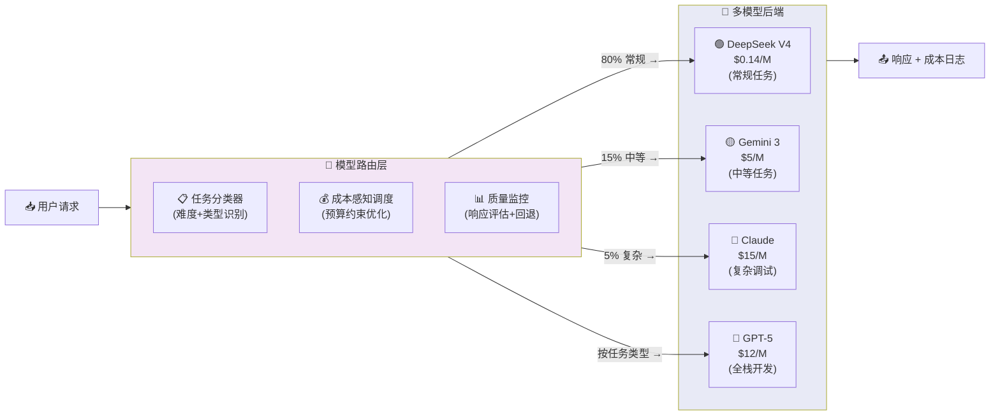

## 15.2 模型选型决策框架

> ⚠️ **内容警告（2026-06-17 审计）**：本节引用的部分模型版本号（"Claude Opus 4.8"、"GPT-5.5"、"DeepSeek V4" 等）在公开信息中无法查证。选型框架的方法论结构（六维矩阵、路由策略等）具有参考价值，但具体模型推荐和排名数据不应直接引用。请以各模型提供商官方发布的最新版本信息为准。
>
> 来源：15-模型选型与评估 | 拆分自 README.md | 2026-06-14

---

## 15.2.1 六维选型矩阵

```mermaid
xychart-beta
    title "编码模型能力-成本二维定位（2026 Q2）"
    x-axis "成本 ($ / 1M output tokens)" [0, 5, 10, 15, 20, 25, 30]
    y-axis "SWE-bench Verified 得分 (%)" 70 --> 95
    line "性价比基准线" [70, 76, 80, 82, 85, 87, 88]
    scatter "Claude (Anthropic)" [15, 88.6]
    scatter "GPT-5 (OpenAI)" [12, 82.6]
    scatter "Gemini 3 (Google)" [5, 79.8]
    scatter "DeepSeek V4" [0.87, 76.2]
    scatter "Llama 4 (Meta)" [0.5, 75]
    scatter "Mistral (EU)" [1, 72]
```

| 维度 | 权重（代码场景） | 评估要点 |
|------|----------------|---------|
| **能力（Capability）** | 40% | 目标任务的基准得分、多语言覆盖、任务类型匹配 |
| **成本（Cost）** | 25% | 输入/输出/缓存定价、Token化效率（同文本不同模型Tokens数差异可达35%） |
| **延迟（Latency）** | 15% | 首Token时间(TTFT)、每秒Token数(TPS)、流式支持 |
| **隐私（Privacy）** | 10% | 数据是否用于训练、BAA可用性、自托管能力、GDPR合规 |
| **合规（Compliance）** | 5% | SOC 2/HIPAA/EU AI Act、数据驻留要求 |
| **生态（Ecosystem）** | 5% | SDK成熟度、IDE集成、社区支持、Agent框架兼容性 |

## 15.2.2 主要模型定位差异

| 模型/提供商 | 核心优势 | 主要短板 | 最佳场景 |
|------------|---------|---------|---------|
| **Claude (Anthropic)** | SWE-bench最高(88.6%)；精准修复；最小diff；长上下文(1M)；缓存90%折扣 | 价格高($5-25/M)；终端/自动化能力较弱；无原生代码执行 | 复杂Bug修复、重构、架构设计、安全审计 |
| **GPT-5 (OpenAI)** | 全能型；终端/DevOps领先(75.1%)；多工具编排(67.2%)；CRUD生成快 | SWE-bench落后Claude(82.6% vs 88.6%)；长上下文定价翻倍 | 全栈开发、终端自动化、原型设计、数据分析 |
| **Gemini 3 (Google)** | LiveCodeBench高(90.8%)；多模态独特优势；价格适中($0.5-2/M) | SWE-bench稍逊(79.8%)；企业生态不如前两者 | 多模态调试、成本敏感高质量场景、跨产品生态 |
| **DeepSeek V4** | LiveCodeBench/Codeforces第一(93.5%/3206)；开源MIT；极低价格($0.14-0.87/M)；1M上下文 | SWE-bench稍逊(76.2%)；合规/数据主权顾虑(中国)；企业支持有限 | 仓库级重构、高容量批处理、成本极度敏感、需自托管 |
| **Llama 4 (Meta)** | 开源(社区许可)；可自托管；能力接近GPT-5.4 91-96% | 能力gap 4-15%；多步推理仍逊于闭源 | 隐私敏感场景、中等复杂度任务、数据不得出境 |
| **Mistral (欧洲)** | Apache 2.0许可；EU数据主权；多语言(80+语言)；法国军方采纳 | 能力不及前沿闭源；生态较小 | GDPR严格合规、欧盟政府/军工、需无限制许可 |

_来源: [futureagi.com LLM Benchmarks 2026](https://futureagi.com/blog/llm-benchmarking-compare-2025/), [AI Vanguard Llama 4 vs GPT-5.4](https://aivanguard.tech/llama-4-vs-gpt-5-4-open-source-vs-proprietary-2026/), [DataVLab](https://datavlab.ai/post/best-open-source-llm-2026-decision-framework)_

## 15.2.3 模型路由策略：实践案例与成本数据

多个2026年的生产系统验证了**层次化模型路由**的巨大价值。核心模式是"80/15/5"工作负载分布：

| 任务类型 | 占比 | 成本/Token | 示例 |
|---------|------|-----------|------|
| 常规任务 | ~70-80% | $0.14-0.50/M | 文件操作、状态检查、格式化、简单问答 |
| 中等任务 | ~15% | $1-5/M | 代码生成、摘要、草稿 |
| 复杂任务 | ~5% | $10-75/M | 调试、架构设计、新问题 |



**关键案例研究：**

| 系统 | 方法 | 成本节省 | 质量影响 |
|------|------|---------|---------|
| **GitHub Copilot (HyDRA)** — 生产部署 | 5模型池+4维能力匹配(推理/代码生成/调试/工具调用) | **54.1%成本节省**（等质量模式）；72.5%（激进模式）| 等质量匹配；激进模式仅失3.2分 |
| **RouteNLP** — 企业客服(ACL 2026) | 难度感知路由+一致性级联 | **58%成本降低**；p99延迟从1847ms→387ms | 91%响应接受率维持 |
| **Brick** — 空间能力路由 | 6维能力评分+每查询难度估计 | **4.71倍成本降低**（中性模式）；**22.15倍**（最低成本模式）| 中性模式74.11%准确率 vs 最佳单模型75.02% |
| **Pyramid MoA** — 分层集成 | 小模型集成+仅困难问题升级到大模型 | **61%计算减少**（GSM8K） | 93.0% vs 98.0% Oracle |

**一个具体的数字案例**：纯高级模型策略在100K tokens/天下约花费**$225/月**；层次化路由降至约**$19/月** — 约**10倍成本降低**。

_来源: [HyDRA (arXiv:2605.17106)](https://export.arxiv.org/abs/2605.17106), [RouteNLP (ACL 2026)](https://browse-export.arxiv.org/abs/2604.23577), [Brick (arXiv:2606.13241)](https://export.arxiv.org/abs/2606.13241), [Pyramid MoA (arXiv:2602.19509)](https://arxiv.org/abs/2602.19509v1)_

---

## 15.2.4 模型适配器层分析：DeepSeek V4 Pro × Claude Code 案例

> ⚠️ 数据来自社区实测（2026年Q2），非 DeepSeek 官方确认。P2 的"11%"基于 N=19 小样本复现（95% CI: 1.4%-33.1%）。SWE-bench 得分变化频繁，以实时基准为准。

### 适配架构

DeepSeek V4 Pro 通过 Anthropic 兼容 API（`https://api.deepseek.com/anthropic`）接入 Claude Code，路径上经历两次协议转换：

```text
Claude Code Harness (TypeScript, Anthropic 格式)
  → DeepSeek 服务端: Anthropic → OpenAI 内部格式
  → DeepSeek V4 Pro (OpenAI Function Calling 训练)
  → DeepSeek 服务端: OpenAI → Anthropic 格式
  → Claude Code 解析
```text

每次转换都是信息损失的潜在点。

### 已知适配问题（P0-P6）

| 等级 | 问题 | 影响 | 状态 |
|:---:|------|------|:---:|
| P0 | CC ≥2.1.166 子Agent兼容性（社区报告） | 子Agent/Worflow崩溃 | ⚠️ v2.1.172实测未触发 |
| P1 | reasoning_content断裂（仅thinking模式） | 多轮工具调用崩溃 | 不加[thinking]后缀可规避 |
| P2 | tool_calls以纯文本泄漏(~11%) | 10步任务完成率从~90%降至~31% | 需模型侧修复 |
| P3 | cache_control被静默忽略 | 每轮全量重处理，注意力稀释 | 定期/compact缓解 |
| P4 | tool_choice部分支持 | 指定具体工具名可能失败，{"type":"any"}可用 | 端点间不对称 |
| P5 | 图片输入不支持 | 视觉分析不可用 | 纯文本模型限制 |
| P6 | thinking块签名不可跨后端移植 | 会话历史不可跨后端复用 | 模型切换限制 |

### 模型路由策略实践

```json
// settings.json 关键配置
{
  "env": {
    "ANTHROPIC_BASE_URL": "https://api.deepseek.com/anthropic",
    "ANTHROPIC_MODEL": "deepseek-v4-pro[1M]",
    "CLAUDE_CODE_SUBAGENT_MODEL": "deepseek-v4-flash"
  }
}
```json

成本优化：子Agent 用 Flash（省 70%+ 成本）；主Agent 用 Pro[1M]（1M 上下文）；视觉/联网场景回退到原生 Claude。

**完整性评估**：严谨性差距由三个因素构成——~35% Harness 设计差异（行动优先姿态）、~40% 适配层损耗（协议转换bug）、~25% 模型能力差异。仅消除适配层损耗即可提升体验严谨性约 40%。

> 参考：GitHub Issues（deepseek-ai/DeepSeek-V3#1244 #1269 #1397）；[完整分析](../../references/deepseek-claude-code-harness-analysis.md)

---

---

## 📎 被以下章节引用

- [15.2 模型选型决策框架](README.md)
