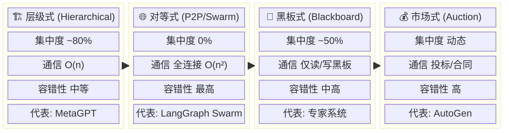

## 16.1 多Agent架构拓扑

> 来源：16-多Agent系统与协作 | 拆分自 README.md | 2026-06-14

---

## 16.1.1 四种拓扑的详细对比

现代多Agent架构可沿**集中化-去中心化**光谱排列。Sandeep Nutakki在《The American Journal of Engineering and Technology》（2026年2月）发表的系统综述中，对企业场景下四种拓扑进行了正式评估，发现多Agent协作相比单Agent基线在复杂任务上**任务完成率提升34%**，但伴随**12-18%的协调开销**[1]。



| 维度 | 层级式 | 对等式 | 黑板式 | 市场式 |
|------|--------|--------|--------|--------|
| **通信复杂度** | O(n)，每层仅与直系通信 | 全连接 O(n²)；Swarm模式 O(k) | 仅读/写黑板 | 投标/合同机制 |
| **集中化程度** | ~80% | 0% | ~50% | 动态 |
| **容错性** | 中等（分支故障局部化） | 极高（无单点故障） | 中高 | 高 |
| **适用场景** | 结构化流水线、多步骤协作 | 广度覆盖、探索性任务 | 专家协同、增量问题求解 | 资源分配、任务竞标 |
| **主要风险** | 顶层Orchestrator单点故障 | 无限路由循环 | 黑板瓶颈 | 竞标开销 |

### 层级式（Hierarchical / Tree）

```text
Planner/Orchestrator
    ├── Manager A (领域A)
    │   ├── Worker A1
    │   └── Worker A2
    └── Manager B (领域B)
        ├── Worker B1
        └── Worker B2
            ↓
        Reviewer (可选的质量把关层)
```text

| 维度 | 特征 |
|------|------|
| 通信复杂度 | O(n)，每层仅与直系父/子节点通信 |
| 集中化程度 | ~80% |
| 容错性 | 中等（分支故障局部化） |
| 横向扩展 | 优秀（添加Worker不触及兄弟分支） |
| 延迟 | 每增加一层=+1次LLM调用延迟 |
| 跨域任务 | 需向上协调至最近公共祖先，成本高 |

**代表性产品**：MetaGPT采用4层流水线——ProductManager→Architect→ProjectManager→Engineer→QAEngineer，模仿真实软件公司SOP。MetaGPT的可配置`n_borg`参数允许多Engineer实例并行开发，多Agent协作组开发效率比单体AI模型提升**3.2倍**，代码缺陷率降低**47%**[2]。在SWE-Bench Lite上达到**46.67%**的问题解决率，HumanEval得分**85.9%**。

**失效模式**：①层间传递的信息损失——每一层Summarize都丢失细节；②域边界设计错误导致任务无法在正确层级执行；③顶层Orchestrator成为认知瓶颈和单点故障。

### 对等式（P2P / Swarm）

所有Agent地位平等，无中心协调者。通过`transfer_to_X`工具进行Handoff：每个Agent自评是否可处理任务，若不可则传递完整上下文给更适合的Agent。

| 维度 | 特征 |
|------|------|
| 通信复杂度 | 全连接O(n²)，Swarm模式O(k)，k=邻居数 |
| 集中化程度 | 0% |
| 容错性 | 极高（无单点故障） |
| 动态适应 | 极高（执行路径随输入内容自适应） |
| 调试难度 | 最高（需聚合所有Agent日志） |
| 风险 | Agent A→B→C→A的无限循环 |

**典范案例**：斯坦福的Generative Agents（"虚拟小镇"）使用25个Agent自组织社交网络。LangGraph Swarm提供`create_swarm()`函数，支持Billing/Tech support/Returns Agent直接互传，无需中心路由器[3]。O'Reilly Radar指出"Swarm在Web研究任务中效果最好，因为目标是覆盖广度而非收敛精度"[4]。

**失效模式**：①无限路由循环；②无全局任务状态仪表板；③n>100时全连接P2P的消息爆炸。

### 黑板式（Blackboard / Shared Memory）

中心化共享"黑板"+N个专家Agent。Agent从不直接通信，只读/写黑板。控制组件根据黑板状态动态激活Agent。

| 维度 | 特征 |
|------|------|
| Token效率 | **最优**（相比传统Master-Worker节省~59%） |
| 松耦合 | 最大——增删Agent对其他Agent零影响 |
| 并发瓶颈 | 黑板是并发热点，需写冲突解决 |
| 全局状态追踪 | 比Pipeline/Supervisor模式更难追踪 |

**代表性实现**：LbMAS（Han et al., July 2025）在推理/数学基准上达到**81.68%**的平均准确率，任务成功率相比传统Master-Worker提升**13-57%**[5]。MetaGPT的共享消息池可视为黑板式轻量衍生。O'Reilly指出"在创意场景中，黑板式架构及共享内存通常比Supervisor模式效果更好"[4]。

**失效模式**：①黑板写入冲突——多个Agent同时更新同一字段；②黑板腐败——错误写入污染共享状态，后续Agent基于错误信息推理；③控制组件故障导致整体停滞。

### 市场式（Market-based / Auction）

任务发布者+资源提供Agent+交易平台。Agent根据能力和当前负载提交竞标，系统选择最优方案。利用经济激励对齐替代人工调度[1]。

| 维度 | 特征 |
|------|------|
| 工程复杂度 | **最高**——需解决虚假竞标、合同违约、声誉系统、冷启动 |
| 自组织 | Agent自利动机与全局最优对齐 |
| 延迟 | 竞标→评估→选择完整周期带来额外延迟 |
| 性能（2025基准） | Market-Making框架相比单模型基线**+10%**的事实性/伦理/常识推理表现 |

**代表性实现**：Agent Exchange（AEX，双层拍卖架构）。Nutakki (2026)的综述中将市场式作为四大拓扑之一进行正式评估，确认其在Agent能力方差大、动态Agent数量的场景中表现最优[1]。

**失效模式**：①新Agent冷启动无竞标历史被饿死；②Agent策略性谎报能力（需声誉系统对抗）；③竞标周期在高频任务中成为延迟瓶颈。

## 16.1.2 主流产品的拓扑选择

### Claude Code Workflow — Pipeline + Parallel 的混合

Claude Code当前采用**Orchestrator-Worker**模型。社区生态已发展出成熟的编排模式：

- **Agentic Sprint**（damienlaine/agentic-sprint）：Spec驱动的状态机，含Python-dev、NextJS-dev、QA、UI-test、CI/CD等专业化Agent。采用"收敛扩散模型"——Spec随工作完成而收缩，错误随迭代衰减[6]。
- **Agent Fleet**（studiomeyer-io/agent-fleet）：Research/Critic/Analyst/Discovery/Repair/CTO Agent以并行讨论回合运行，Postgres检查点支持崩溃恢复和Human-in-the-Loop[6]。
- **Claude Code Agency**（codeoutin/claude-code-agency）：6-Agent顺序管道（Context Gatherer→Task Planner→Implementation→Quality Reviewer→Frontend Tester→Code Critic），含5轮验证循环和20轮错误修复重试[6]。

**关键创新**：Agent自监控输出Token预算，在~80%容量时生成Handoff Manifest，为后继Agent保留状态——实现无限输出长度的任务执行。Anthropic官方在2025年11月确认"正在开发支持协调多个Claude Code以加速完成时间"的功能（Issue #3013）[6]。

Claude Code的拓扑选择本质上是**按需层级化**：简单任务保持Orchestrator-Worker，复杂任务演化为Hierarchical，独立并行任务采用Agent Teams（设置`CLAUDE_CODE_EXPERIMENTAL_AGENT_TEAMS=1`）——Agent间通过SendMessage进行P2P通信。

### GitLab Duo Agent Platform — 顺序Flow编排

GitLab Duo Agent Platform采用**静态顺序Flow**拓扑。核心是YAML定义的Flows——多Agent多步骤工作流。截至最新文档，存在以下特征[7]：

- **仅支持静态顺序路由**：`from: A, to: B`（硬编码路径），无并行fan-out、无fan-in join、无条件分支
- **并行执行尚未实现**——尽管平台愿景明确描述Agent同时运行
- **触发机制**：`@mention`在Issue/MR中，`/assign @flow-name`，或UI按钮

**上下文隔离模型**：GitLab的RLM（Recursive Language Models）策略独树一帜[7]：

- **Context-as-Variable**：完整上下文（1000万+ tokens）存储在沙箱化REPL中，不入LLM上下文窗口
- **Inter-Agent Context Bridge**：Agent A的输出存储为REPL变量供Agent B使用，Agent B仅看到元数据（如"diff: 45K tokens, 23 files changed"），按需通过`peek`/`grep`/`search`拉取
- 每个Flow执行获得自己的**沙箱化工作区**，Agent运行在GitLab Runner的Docker中，使用Anthropic SRT沙箱隔离

### Devin（Cognition）— 非Multi-Agent，而是单Agent+深度工具使用

Devin联合创始人Walden Yan在2025年6月**公开批评多Agent框架**（OpenAI Swarm、Microsoft AutoGen）称其"推广了错误的Agent构建理念"[8]：

> "多Agent框架的表现远低于预期……这种看似高效的架构实际上非常脆弱。"

Cognition的核心立场：

- **共享上下文原则**：所有Agent必须共享前序Agent的**完整Trace/上下文**，不仅是消息。并行运行且互不可见的多Agent产生冲突且脆弱的输出。
- **行为隐含决策原则**：隔离Agent间决策不一致导致系统性失败。

Devin实质上是一个**单Agent系统+工具集成的子能力**，结构类似语义操作系统[8]：

```python
while not task_finished:
    perception = env.observe()
    plan = llm.plan(perception)
    action = executor.run(plan)
    feedback = env.evaluate(action)
    memory.store(plan, action, feedback)
```python

关键组件：Memory（上下文+任务存储）、Planner（决策+任务分解）、Executor（工具执行+代码运行）、Feedback Loop（错误检测+自我修正）。**DeepWiki**是Devin的核心创新——从代码库提取概念，构建基于图的表示（文件=节点，关系=边），使Agent能"一眼"理解架构结构[8]。

Devin 2.0（2025年4月）支持**Parallel Devins**——旋转多个Devin实例并发工作，但每个实例仍是独立的单Agent，通过工作区隔离而非Agent间通信实现并行。

### 拓扑选择对比

| 产品 | 拓扑 | 集中化程度 | 并行支持 | 核心哲学 |
|------|------|:----------:|:--------:|----------|
| Claude Code Workflow | Orchestrator-Worker→可升级为Hierarchical/Agent Teams | 70-90% | 是（可选） | 按需演化 |
| GitLab Duo | 静态顺序Flow | 100%（Flow Orchestrator） | 未实现 | 安全>效率 |
| Devin | 单Agent+工具（非传统多Agent） | 100% | 是（多实例，非通信） | 深度>广度 |
| MetaGPT | 4层Hierarchical | 90% | 是（n_borg） | SOP即代码 |
| LangGraph | Supervisor或Swarm | 可配置 | 取决于模式 | 框架灵活性 |

## 16.1.3 各拓扑的适用场景和失效模式

**工程界共识**（来自O'Reilly、LangGraph、EmergentMind 2024-2025）的决策逻辑[4]：

| 场景 | 推荐拓扑 | 原因 |
|------|----------|------|
| 固定工作流，≤10 Agent | Orchestrator-Worker | 最简单的起点 |
| 固定工作流，>10 Agent | 层级式 | 横向扩展+故障隔离 |
| 无预定义步骤、复杂推理、严格Token预算 | 黑板式 | 最佳Token效率+动态Agent激活 |
| >20种输入类型、需动态路由 | Swarm | 自适应Handoff |
| Agent能力差异大、动态数量、自动调度 | 市场式 | 经济激励对齐 |
| 跨组织、隐私关键 | 联邦式 | 数据不出域 |
| 质量最大化、预算无约束 | Mixture-of-Agents (MoA) | 多头并行的最优输出 |

**核心行业趋势**（O'Reilly Radar, 2025）[4]：多Agent论文从2024年的820篇飙升至2025年超2500篇。领域的核心认识是：**协调拓扑——而非模型规模或Prompt质量——是系统成功的主要决定因素**。混合模式（小型快速专家并行+慢速聚合器检查假设）正在成为生产环境最佳实践。

---

---

## 📎 被以下章节引用

- [16.1 多Agent架构拓扑](README.md)
