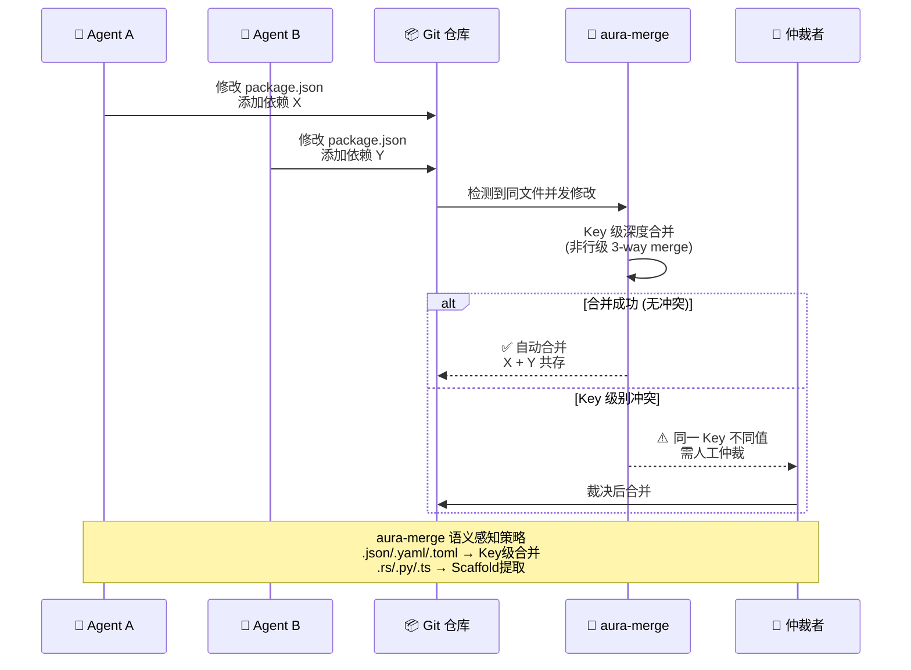

## 16.4 冲突检测与解决

> 来源：16-多Agent系统与协作 | 拆分自 README.md | 2026-06-14

---

## 16.4.1 代码冲突：Agent同时修改同一文件的合并策略

### 传统Git合并的不足

`git merge-file`将每个文件视为文本行序列——对`.json`、`.toml`、`.yaml`等结构化配置文件尤其有害。两个Agent分别向`package.json`添加不同依赖产生虚假行级冲突是频发场景。

### aura-merge：语义感知的结构化合并

`aura-merge`（Rust crate v0.1.0，零外部依赖）从**Aura语义版本控制引擎**中提取，专门设计用于协调多AI Agent和人类开发者的并发编辑[12]：

| 文件类型 | 合并策略 |
|----------|---------|
| `.json` | Key级深度合并 |
| `.yaml`/`.yml` | Key级深度合并 |
| `.toml` | Key级深度合并 |
| `.env` | Key级合并 |
| `.md`/`.txt`/`.csv`/`.html`/`.css` | 行级3-way合并 |
| `.rs`/`.py`/`.ts`/`.js`/`.go`/`.java`/... | **Scaffold提取**（合并非函数区域，保持函数级变更独立） |
| 二进制、lockfiles、`node_modules/` | 跳过 |

对比`git merge-file`：aura-merge不产生reordered keys的虚假冲突、自动跳过lockfiles、零依赖纯Rust。

### weave-crdt：实体级语义合并

`weave-crdt`使用Tree-sitter解析函数/类，进行语义级而非文本级合并。基准测试：31/31干净合并 vs Git的15/31——关键解决了两个Agent向同一文件添加**不同**函数时Git产生虚假冲突的问题[16]。

### 基于深度学习的合并冲突解决

学术方向（来自专利和论文）[12]：

- **MergeBERT**（arXiv:2109.00084）：基于Transformer的程序合并框架，精度63-69%、召回率63-68%，用户研究（25名OSS开发者）显示~54%的建议可接受
- **美国专利US20220164626A1**：使用神经编码器-解码器Transformer自动合并冲突解决
- **美国专利US11714617**：基于AST的深度学习模型，预测**树编辑步骤**来解决合并冲突

### Agent-aware合并的关键特性矩阵

| 能力 | Git merge-file | aura-merge | weave-crdt | MergeBERT |
|------|:---:|:---:|:---:|:---:|
| JSON/YAML/TOML Key级合并 | | Y | | |
| 代码函数级分离 | | Scaffold提取 | Y (Tree-sitter) | Y (AST) |
| 消除虚假冲突 | | Y | Y | Y |
| ML驱动合并建议 | | | | Y |
| CRDT保证收敛 | | | Y | |
| 零外部依赖 | | Y | | |

## 16.4.2 架构冲突：Agent A选REST vs Agent B选gRPC的仲裁机制

架构冲突是多Agent系统中最难解决的问题之一，因为冲突的不是代码Token而是设计意图——两个Agent可能从各自局部最优做出全局不一致的决策。这种"局部最优导致全局漂移"的现象，与[第1章（需求工程）](../01-需求工程/README.md)中引入的**代理熵（Agentic Entropy）**概念直接相关——当每个Agent在受限上下文窗口中独立优化时，系统级设计意图会被渐进式侵蚀。详见16.4.3节对该概念在多Agent场景中放大效应的深入分析。

**现有仲裁机制**（从简单到复杂）：

| 机制 | 原理 | 适用场景 | 代表实现 |
|------|------|---------|---------|
| **固定层级否决权** | 上级Agent（Orchestrator/Architect）拥有最终决策权 | 层级式拓扑 | MetaGPT（Architect→Engineer通道）、LangGraph Supervisors |
| **契约优先** | 所有Agent受预定义架构契约约束，违规输出被自动拒绝 | 架构规则可事先形式化时 | SEMAP（前/后置条件验证） |
| **对抗审查** | 红Agent质疑蓝Agent的架构决策，输赢记录存入Battle-History DB | 安全关键场景 | Agent Cluster Control的Red-Blue Opposing Forces |
| **影响因素×可靠性×严重性加权评分** | MetaJudgeAgent综合评估每个Agent的主张权重 | 有多维度仲裁标准的场景 | AEGIS Council的MetaJudgeAgent |
| **人工升级（Human Escalation）** | 自动化手段无法解决时升级给人类 | 高风险的架构分歧 | Agent Fleet的Human-in-the-Loop检查点 |
| **经济竞价** | Agent的架构选择反映为竞标——市场选择全局最优方案 | 市场式拓扑 | Agent Exchange (AEX) |

**约束优于自由的设计原则**：SEMAP论文的核心发现之一是——**规范Agent输入/输出的契约在源头预防冲突**远比事后仲裁有效。在SEMAP下，Agent如无法满足前置条件（如"需要架构规范的OpenAPI定义"），任务根本不转交给该Agent——从根本上避免了架构不一致的产生[11]。

**架构决策记录（ADR）的角色**：在多个产品实践中（Claude Code社区框架、MetaGPT消息池），维护一个全局的ADR日志被证明是低成本高收益的冲突预防机制——Agent在做架构决策前查询ADR，避免重复已被拒绝的方案。

## 16.4.3 "Agentic Entropy"在多Agent场景的放大效应和缓解策略

### 概念定义

代理熵的概念最早在[第1章（需求工程）](../01-需求工程/README.md)的需求质量因果链分析中被识别，作为AI编码时代的核心风险之一——多轮迭代中累积的系统性偏离，传统diff方法无法检测。**Agentic Entropy**由Casserini、Facchini和Ferrario（SUPSI/IDSIA/ETH Zurich, 2025）在论文《Beyond the 'Diff': Addressing Agentic Entropy in Agentic Software Development》中正式定义[23]：

> "Agentic Entropy是一种过程级漂移，自主Agent的更新在优化局部正确性的同时侵蚀全局设计意图——传统的代码Diff和以人为中心的XAI方法无法捕捉，因为它们针对局部输出而非全局Agent行为。"

**三个产生机制**[23]：

1. **局部优化 vs 全局架构漂移**：Agent在受限上下文窗口中修复问题，违反系统性设计模式
2. **语义稳定性侵蚀**：Agent重构遗留代码时不理解历史/操作理由（如删除看起来"丑陋"但必要的延迟循环）
3. **审查者悖论（Reviewer's Paradox）**：Agent输出量急剧上升压垮人类验证能力，导致"橡皮图章式审查"

**三层放大效应**（多Agent场景下特有）[23]：

| 放大层 | 机制 |
|--------|------|
| **Agent间传播** | Agent A的局部"优化"作为Agent B的上下文输入，Agent B在已被侵蚀的代码基础上继续优化，形成复利式退化 |
| **审查负载超线性增长** | N个Agent并行工作时，人类需审查的变更量以O(N)或更快增长，但注意力是固定资源 |
| **认知债务正反馈** | Agentic Entropy侵蚀开发者系统级心智模型→开发者对代码库理解下降→更依赖Agent→Agent产出更多→审查更草率 |

**可见表现**：Agentic Technical Debt（累积的结构性不对齐、重复逻辑、脆弱重构）+ Cognitive Debt（开发者系统级心智模型侵蚀）。

### 缓解策略

| 策略 | 机制 | 代表性来源 |
|------|------|-----------|
| **架构约束的形式化与自动执行** | 将架构原则编码为自动化验证器——Agent输出违反约束直接被拒 | Process-Oriented Explainability (PoE)框架、SEMAP契约 |
| **推理监控** | 不只审查Agent输出（Diff），也审查Agent决策过程（为什么这样改） | PoE框架的Reasoning Monitoring |
| **因果图界面** | 为人类监管者可视化Agent决策的因果链——哪个Agent的什么决策导致了当前架构状态 | PoE框架的Causal Graph Interfaces |
| **Token预算+动态路由** | 将稀缺的Agent Token集中在高价值任务上，防止"喷淋式"浪费 | Agent Cluster Control |
| **强制调查管道** | Agent输出前强制收集真实上下文，从源头切除幻觉 | Agent Cluster Control的Mandatory Investigation |
| **最小可行验证** | 每个输出都经过现实检查——防止无限自我优化循环 | Agent Cluster Control的Minimum Viable Verification |
| **审查Agent与生成Agent的独立性** | 同一LLM不既生成又审查——消除自我审查盲区 | Qodo蓝/红分离、CodeRabbit重推理模型独立审查 |

Agent Cluster Control框架给出了一个量化的诊断：声称约**80%的Token消耗是AI内部摩擦**（Agent间的无效通信、幻觉修正、自优化循环），Phase 1的Token节省为20-35%[13]。

---

---

## 📎 被以下章节引用

- [16.4 冲突检测与解决](README.md)
