## 17.1 Agent 可观测性三支柱

> 来源：17-可观测性与评估 | 拆分自 README.md | 2026-06-14

---

## 17.1.1 Trace：Agent 决策链路的端到端追踪方案

Agent 决策链路涉及 LLM 调用、工具调用（Tool Call）、检索增强（RAG）、守卫决策（Guardrails）等多层嵌套执行。端到端追踪需将每次模型调用、每个工具执行、每个检索步骤包装为分布式 Trace 中的 Span，通过`trace_id`串联全链路。

```mermaid
flowchart TB
    subgraph PILLARS["🔍 Agent 可观测性三支柱全景"]
        direction LR
        subgraph TRACE["📍 Trace — 链路追踪"]
            T1["🔗 端到端 Span 链<br/>LLM Call → Tool Call → RAG → Guardrail"]
            T2["🆔 trace_id 串联全链路"]
            T3["📊 OpenInference/OTel 语义约定"]
            T4["⏱️ 延迟归因到每个 Span"]
        end
        subgraph LOG["📝 Log — 结构化日志"]
            L1["📋 五大类别 Schema<br/>决策/请求/响应/错误/性能"]
            L2["🧠 reasoning 思考链记录"]
            L3["⚠️ error.type 分类<br/>timeout/rate_limit/api_error"]
            L4["🔍 全文检索 + 关联查询"]
        end
        subgraph METRICS["📈 Metrics — 量化指标"]
            M1["✅ 成功率 / 延迟 P50 P95 P99"]
            M2["💰 Token 消耗 + 成本归因"]
            M3["🎯 LLM-as-Judge 质量评分"]
            M4["🚨 告警：连续失败率 >10%"]
        end
    end
    TRACE -->|"Span 关联"| LOG
    LOG -->|"聚合统计"| METRICS
    METRICS -.->|"异常触发"| TRACE
    style PILLARS fill:#f0f4ff
    style TRACE fill:#e3f2fd
    style LOG fill:#fff3e0
    style METRICS fill:#e8f5e9
```



### 四家平台能力对比

| 能力维度 | Langfuse | Braintrust | Arize Phoenix | Weights & Biases Weave |
|---|---|---|---|---|
| **License** | MIT 核心（企业目录独立） | 闭源商业 | Elastic License 2.0（非 OSI） | 闭源（有免费层） |
| **自托管** | 是（Docker: Postgres + ClickHouse + Redis） | 仅企业版 | 是（`phoenix.launch_app()`） | 否 |
| **Span 类型数** | 5 种（generation, tool, span, event, agent） | 实验范围内 trace | 8 种（OpenInference 规范） | 10+种（含 Chain/Agent/Tool/Rerank） |
| **Agent 原生支持** | 有 agent span，支持多步决策追踪 | 沙盒化 Agent Eval（带工具调用执行） | OTel 原生，OpenAI Agents SDK、LlamaIndex、LangChain 自动插桩 | Weave Agent Protocol，支持 LangGraph/CrewAI/AutoGen |
| **OTel 兼容** | 支持 OTel 摄取 | 不强调 OTel | **OpenInference 规范定义者**，OTLP 优先 | 兼容 OTel 导出 |
| **Prompt 寄存器** | 有（版本化、部署标签、环境管理） | 有（实验驱动） | 无专用寄存器 | 有 Prompts 管理 |
| **MCP 支持** | 2026 年支持 | 2025 年支持 | 有限 | 2026 年支持 |
| **成本追踪** | 完整（延迟+成本+Eval） | 实验范围成本 | 部分（延迟+漂移+Eval） | 完整（延迟+成本+评估通过率趋势） |
| **入门价格** | Hobby 免费（50K 单位/月），Core $29/月 | Starter 免费，Pro $249/月 | Phoenix 免费自托管，AX Pro $50/月 | Free 层，Teams $89/月起 |

**关键差异：**

- **Langfuse** 是开源阵营最受欢迎的 LLM 可观测性平台。其 Trace 功能包括：Prompt/Tool Call/Response 的完整链式 Span；Prompt 版本化管理（支持部署标签、环境隔离、回滚）；实验 CI/CD 集成（2026 年 5 月发布）。
- **Arize Phoenix** 是 OpenTelemetry 原生的参考实现。核心优势在于自动插桩覆盖 LlamaIndex、LangChain、DSPy、Mastra、Vercel AI SDK、OpenAI Agents SDK、Bedrock、Anthropic 等框架（Python、TypeScript、Java 均支持）。同时具备 Embedding 漂移检测的独特能力。
- **Braintrust** 的 Agent Eval 支持沙盒化工具调用执行——可在隔离环境中真实执行 Agent 的工具链并评估结果，在 Agent 多步决策评估深度上领先。
- **W&B Weave** 拥有最丰富的 Span 类型（10+种），对 LLM 链式调用、Agent 决策树、工具路由等复杂拓扑的建模能力最强，适合研究导向的深度 Trace 分析。

### Trace 采集的行业标准：OpenInference/OTel 语义约定

OpenTelemetry 社区和 OpenInference 项目共同定义了 GenAI Span 的标准化属性：

```json
// 请求属性
{ "llm.request.model": "gpt-4-turbo", "llm.request.provider": "openai" }
// 用量指标
{ "llm.usage.input_tokens": 245, "llm.usage.output_tokens": 312,
  "llm.usage.total_tokens": 557, "llm.usage.cost": 0.012 }
// 响应属性
{ "llm.response.status": "completed", "llm.response.duration": 2300 }
```json

2025 年的最佳实践共识是：**Langfuse 做 Trace 存储+Prompt 管理，Promptfoo 做 CI 回归测试，两者配对是目前最成熟的开源方案。**

来源：FutureAGI "W&B Weave Alternatives in 2026" (2026)；Braintrust "Langfuse vs. Braintrust" (2025)；Arize Blog "LLM Observability for AI Agents" (2025)；Coralogix "OpenTelemetry for AI" (2025)

---

## 17.1.2 Log：结构化日志的最佳实践

### Schema 设计原则

根据 Skywork.ai 的 2025 年生产级指南，结构化日志 Schema 需覆盖五大类别：

**核心 Schema 字段：**

| 类别 | 字段 | 说明 |
|---|---|---|
| **身份与关联** | `request_id`, `session_id`, `user_id_hash`, `trace_id`, `span_id` | 支持全链路关联查询 |
| **Prompt 层** | `prompt_template_id`, `prompt_template_version`, `sanitized_prompt`, `system_instructions`, `examples_hash` | Prompt 版本和内容追踪（需脱敏） |
| **模型配置** | `model.name`, `model.provider`, `model.temperature`, `model.max_tokens`, `model.top_p`, `model.seed` | 完整的模型调用参数 |
| **工具调用** | `tool_name`, `inputs`（脱敏）, `outputs`（脱敏）, `latency_ms`, `status` | 每次 Tool Call 的输入输出和状态 |
| **RAG 上下文** | `corpus`, `retrieved_doc_ids`, `relevance_scores`, `source_attribution` | 检索质量和溯源 |
| **守卫决策** | `intervention_type`, `policy_category`, `confidence_score`, `action_taken` | PII/越狱/毒性检测的干预记录 |
| **输出信号** | `raw_text`（脱敏）, `parsed_output`, `safety_labels`, `cache_hit` | 结构化输出和缓存命中 |
| **用量/成本** | `input_tokens`, `output_tokens`, `total_tokens`, `estimated_cost_usd`, `retries` | Token 消耗和预估成本 |
| **反馈信号** | `rating`, `thumbs_up/down`, `free_text_comment` | 用户反馈 |
| **部署信息** | `app_version`, `prompt_pack_version`, `evaluator_version` | 版本溯源 |

### Prompt / Tool Call / Response / Error 的日志 Schema 设计

**1. Prompt 日志**：记录`prompt_template_id`+`prompt_template_version`而非全量 Prompt 文本。对 Prompt 内容进行`sanitized_prompt`脱敏（移除 PII）。通过`prompt_template_version`实现 Prompt 变更的精确溯源。

**2. Tool Call 日志**：每个工具调用记录为独立的`skill`对象数组——包含`tool_name`（工具名称）、`inputs`/`outputs`（脱敏后的参数）、`latency_ms`（执行耗时）、`status`（ok/error/timeout）。错误时附加`error.message`和`error.type`。

**3. Response 日志**：记录`raw_text`（脱敏后）、`parsed`（结构化输出）、`safety_labels`（安全分类）、`cache_hit`（是否命中缓存）。缓存命中可节省 40-70%的 Token 成本。

**4. Error 日志**：必须包含完整的错误上下文——`error.message`、`error.stack`、`error.type`（timeout/rate_limit/api_error/validation_error/guardrail_block）、发生错误的 Span 位置、关联的`trace_id`和失败时的 Agent 状态快照。

### 七大日志反模式（2025 年行业共识）

1. **全量 Prompt/Response 记录** → PII 风险和存储爆炸
2. **缺失父 Span** → 孤立的操作无法关联到上游调用
3. **日志中的密钥泄露** → API Key 写入 Span 属性
4. **阻塞式遥测** → 热路径上的同步日志发送导致延迟激增
5. **高基数 Span 名称** → 动态值嵌入 Span 名称破坏查询效率
6. **无 Token/成本追踪** → 生产环境的成本盲区
7. **缺失错误上下文** → 无法重构失败时的完整状态

来源：Skywork.ai "Observability for Skills: Best Practices in Logs, Evals, and Regression" (2025)；Traceloop "How to Trace LLM Agents and Find Failures" (2025)；Nexus Labs agent-observability (2025)

---

## 17.1.3 Metrics：关键指标定义

### 1. Task Success Rate（任务成功率）

**定义**：Agent 执行完成指定目标且无错误的执行次数占比。

**细分维度：**

- **完全完成**（Full completion）：Agent 独立完成整个任务
- **部分完成**（Partial completion）：任务部分达成，需人工辅助
- **一次性成功率**（One-shot success rate）：无需任何人工干预或纠正即完成任务

**关键数据**：KTH 皇家理工学院对 60,000 条执行轨迹的研究发现，同一任务在不同运行中的成功率波动可达**24.9 个百分点**。Agent 在一小时内的任务成功率为 70-80%，但超过四小时的任务成功率骤降至 20%以下。

来源：KTH Royal Institute study on 60,000 trajectories; n8n "AI Agent Performance Metrics" (2025); IBM "AI Agent Evaluation" (2025)

### 2. Token Efficiency / Token Efficiency Ratio (TER)

**定义**：Agent 完成任务所消耗的 Token 数量，通常表述为 Token 用量与完成质量的关系比。

**计算公式**：TER = 完成任务所需 Token 数 / 基线模型 Token 数（或最小必要 Token 数）

**关键意义**：如果模型 A 用 100K Token（$1.50）解决问题，模型 B 需要 2.5M Token（$37.50），基准测试分数几乎相同——那么仅凭基准测试分数会产生严重误导。Goldman Sachs 预测到 2030 年全球 Token 消耗量将增长**24 倍**，主要由企业 AI Agent 驱动。

**监控维度**：

- `input_tokens`和`output_tokens`分别追踪——常见激增原因包括对话历史膨胀、冗余上下文加载
- Reasoning Token 单独计量——推理模型的内部思考 Token 可达可见输出的 60 倍
- 缓存 Token 与未缓存 Token 分离统计——缓存读取成本约为未缓存的 10%

来源：Goldman Sachs Token Consumption Forecast (2025); FutureAGI "LLM Cost Tracking Best Practices" (2026); LayerLens "Evaluate AI Agents" (2025)

### 3. Time-to-Completion（完成时间）

**定义**：从触发/请求到任务完成的端到端耗时。

**子指标：**
| 子指标 | 定义 | 用途 |
|---|---|---|
| Time to First Token (TTFT) | Agent 产生第一个 Response Token 前的延迟 | 感知性能和用户体验 |
| Tokens Per Second (TPS) / Throughput | 生成速率 | 模型效率 |
| End-to-End Latency | 完整用户请求→完成的全过程 | 终端用户 SLA |
| Component Latency | 各步骤的耗时分解（Plan、Reasoning、Tool Call、Retrieval） | 瓶颈定位 |

**最佳实践**：P95/P99 延迟比均值更有意义——长尾异常请求（Agent 陷入循环或外部 API 超时）是影响用户体验的主要来源。

来源：InformIT "First Steps with AI Agents" (2025); Tricentis "AI Agent Evaluation" (2025)

### 4. Defect Rate（缺陷率）

**定义**：Agent 组件或工作流中错误/失败的发生频率。涵盖范畴：

- **计划生成失败率**（Plan generation failure）
- **工具调用错误率**（Tool call error rate）——工具选择错误、执行超时、结果解析失败
- **幻觉率**（Hallucination rate）——Agent 生成未基于上下文的信息的频率
- **Schema 合规失败率**（Schema compliance failure）——结构化输出不符合预期格式
- **守卫触发率**（Guardrail intervention rate）——PII/越狱/毒性检测的干预频率
- **数据访问失败率**（Database access fault rate）

来源：Blaxel "AI Observability for Coding Agents" (2025); Tricentis "AI Agent Evaluation" (2025)

---

---

## 📎 被以下章节引用

- [17.1 Agent 可观测性三支柱](../14-Agent-Harness 与运行时/147-Harness 可观测性.md)
- [17.1 Agent 可观测性三支柱](README.md)
