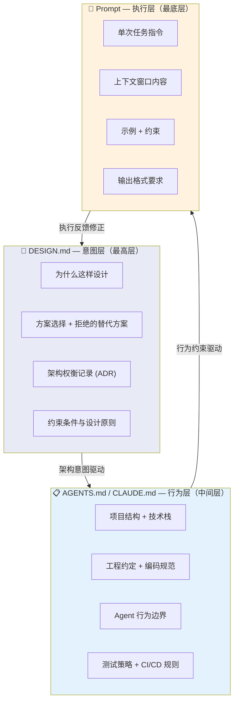

## 18.3 指令文件工程

> 来源：18-提示工程与上下文工程 | 拆分自 README.md | 2026-06-14

---

## 18.3.1 CLAUDE.md vs AGENTS.md vs Cursor Rules (.mdc) 比较分析

### 综合对比表

| 维度 | **AGENTS.md** | **CLAUDE.md** | **Cursor Rules (.mdc)** |
|------|--------------|---------------|------------------------|
| **创建者/维护者** | Linux Foundation (Agentic AI Foundation) | Anthropic | Cursor Inc. |
| **出现时间** | 2025 年中 | 2024 年末 | 2024 年末（替代旧.cursorrules） |
| **格式** | 纯 Markdown（无 frontmatter 要求） | Markdown + `@import` 引用 | Markdown + YAML frontmatter |
| **存放位置** | 仓库根目录（支持嵌套） | 仓库根、`~/.claude/`、嵌套 | `.cursor/rules/*.mdc` |
| **兼容工具** | Codex, Cursor, Copilot, Gemini CLI, Windsurf, Aider, Zed, Claude Code 等 20+工具 | Claude Code only | Cursor only |
| **范围控制** | 最近文件优先（目录层级） | 3 层记忆（全局→项目→本地） | Glob 模式 + 4 种激活模式 |
| **设计哲学** | 通用最低公分母，工具无关 | 功能最丰富，深度 Claude 集成 | 精确制导，按文件类型激活 |
| **企业支持** | 无 | 支持`/etc/claude-code/CLAUDE.md`组织级策略 | 无 |



### 设计哲学深度对比

**AGENTS.md（Linux Foundation）**:

- **核心理念**: "一个文件，所有 Agent"——针对多工具团队的最简方案
- **关键约束**: 无 frontmatter、无必需 Schema、纯 Markdown——降低采纳门槛
- **范围规则**: Nearest-file-wins（子目录中放 AGENTS.md 自动覆盖父级）
- **采纳数据**: 60,000+仓库已采用（2026 年数据）
- **迁移模式**: 开源项目常见做法——AGENTS.md 作为唯一真实来源，CLAUDE.md 简化为`@AGENTS.md`引用

**CLAUDE.md（Anthropic）**:

- **核心理念**: "3 层记忆体系" + 自动记忆——让模型越用越懂项目
- **层级结构**: `~/.claude/CLAUDE.md`（用户级全局）→ `./CLAUDE.md`（项目级）→ `./CLAUDE.local.md`（私有覆盖）
- **@import 系统**: 支持 5 层深度的文件引用——实现指令文件的模块化
- **Auto-Memory**: Claude 自动将经验写入`~/.claude/projects/<project>/memory/`
- **推荐上限**: ~200 行/文件

**Cursor Rules (.mdc)**:

- **核心理念**: 精确制导——不同文件类型触发不同规则
- **4 种激活模式**:
  - `alwaysApply: true` —— 每次请求附加
  - `alwaysApply: false` + `globs` —— 仅编辑匹配文件时激活
  - `description` 无 `globs` —— Agent 阅读描述后自行决定
  - 手动 —— 用户以`@rule-name`调用
- **最佳场景**: Monorepo 团队、多语言混合项目

### 选择决策矩阵

| 场景 | 推荐方案 |
|------|---------|
| 混合工具团队（Cursor + Copilot + Claude） | AGENTS.md 作为唯一真实来源 |
| Claude Code 专一用户 | CLAUDE.md（功能最丰富） |
| Cursor 为主 + Monorepo | AGENTS.md + `.cursor/rules/` 补充范围覆盖 |
| 开源项目（贡献者工具未知） | 仅 AGENTS.md |
| GitHub 原生，Copilot 为主 | `.github/copilot-instructions.md` + AGENTS.md |
| 需要任务特定能力 | 补充 SKILL.md（Anthropic 生态） |

### 有效性数据

**Princeton/ETH Zurich 联合研究 (2026)**:

- 人工编写的 AGENTS.md 提升任务成功率约**4%**，减少运行时间约**28.6%**
- LLM 生成的指令文件**降低**成功率约**3%** —— 手写策展、保持简短是硬要求

## 18.3.2 指令文件的模块化架构

### 核心模式

```text
指令文件 = 基础指令 + 按需加载的模块

基础层（始终加载）:
  ├── 构建/测试命令
  ├── 代码风格骨架
  └── 硬约束（不修改的文件、安全边界）

模块层（按场景/按需加载）:
  ├── 按技术模块: 前端规则 / 后端规则 / 数据库规则
  ├── 按任务场景: 调试模式规则 / 重构模式规则 / Review 模式规则
  └── 按角色: 开发者指令 / Code Reviewer 指令 / 测试者指令
```text

### 三种拆分策略对比

| 拆分维度 | 适用场景 | 实现方式 | 优点 | 缺点 |
|---------|---------|---------|------|------|
| **按技术模块** | Monorepo 多语言项目 | 每个子目录放 AGENTS.md | 自动激活，无额外配置 | 同质化项目冗余 |
| **按任务场景** | 单一项目多任务形态 | Cursor Rules 全局+场景描述 | 按需激活，精准制导 | 需维护多个文件 |
| **按角色** | 多 Agent 协作系统 | CLAUDE.md 中@import 角色文件 | 角色分离清晰 | 跨角色冲突难协调 |

### 动态组装机制

1. **CLAUDE.md 的@import**: `See @docs/api-conventions.md` —— Claude 自动读取被引用文件（最多 5 层深度），实现"基础文档 + 细节按需加载"。

2. **Cursor Rules 的 glob 激活**: `.mdc`文件的 YAML frontmatter 中声明`globs: ["src/graphql/**/*.ts"]`，仅当 Cursor 编辑匹配文件时才注入该规则。

3. **AGENTS.md 的嵌套覆盖**: `root/AGENTS.md`（全局规则）→ `root/backend/AGENTS.md`（后端专属）→ `root/backend/auth/AGENTS.md`（认证模块专属）——最近文件优先。

4. **Conductor 方法论 (Forrester, 2025)**: 提出结构化的`.conductor/`目录，包含`plan.md`、`status.md`、`architecture.md`、`code_styleguide.md`、`workflow.md`，将 Agent 上下文锚定到可维护的文档结构中。

## 18.3.3 指令漂移的自动检测

### 漂移类型

| 漂移类型 | 现象 | 检测方法 |
|---------|------|---------|
| **路径漂移** | 指令引用的文件/目录已不存在 | 文件系统校验 |
| **脚本漂移** | npm/pnpm/make 命令已从 package.json/Makefile 消失 | 解析构建配置文件 |
| **时间漂移** | 年份引用超过 2 年 | 正则匹配 + 日期对比 |
| **语义漂移** | 代码库架构变化导致约束过时 | AST/Grapg 分析 |
| **风格漂移** | 编码规范与实际代码不一致 | Tree-sitter 查询验证 |

### 检测工具生态

| 工具 | 能力 | 数据 |
|------|------|------|
| **ContextCov** (UW Research, 2025, arXiv:2603.00822) | 将被动 Agent 指令转化为可执行护栏——AST 分析、Shell Shim、架构验证器。跨 723 个仓库提取 46,000+检查项，**99.997%有效性** | 723 repos, 46K+ checks |
| **agent-context-lint** (npm, 2026) | Lint 指令文件：检测断裂路径、缺失脚本、过期日期、模糊指令、自相矛盾。输出**0-100 质量分数** | 支持 CLAUDE.md, AGENTS.md, .cursorrules |
| **Evolution Engine** (GitHub Action) | 检测 AI 辅助提交导致的架构漂移。基于 200+仓库、618 万信号、44 个经验证的跨信号模式校准。**1.6%误报率** | 200+ repos, 6.18M signals |
| **instruction-files** (Rust crate) | 审计 AGENTS.md/CLAUDE.md 的过期状态、断裂树路径、行预算溢出、机器特定路径 | Rust 生态 |
| **Codocia** (Rust crate) | 通过哈希快照将 Markdown 页面绑定到代码文件，追踪文档漂移 | 设计用于 AI Agent 工作流 |

### 工程实践建议

1. **CI/CD 集成**: 将 agent-context-lint 或 Evolution Engine 加入 CI 管道，每次 PR 或定时触发检测。
2. **Agent 自我检测**: 在 System Prompt 中注入"每次任务开始前验证以下引用路径是否存在：[list]"。
3. **约束重新注入**: 每 N 轮对话自动将核心约束重新追加到上下文末尾，对抗指令稀释。
4. **Forrester (2025) 的 Conductor 方法论**: 将上下文分解为`plan.md` / `status.md` / `architecture.md` / `code_styleguide.md` / `workflow.md`，每个文件有自己的更新触发条件和责任人。

---

## 18.3.4 指令文件治理最佳实践

> ⚠️ Karpathy 四条规则的错误率数据（41%→11%）来自社区开发者 Mnimiy 的 30 个代码库 × 50 个任务 × 6 周个人测试，非经同行评审的研究。arXiv 2604.11088 提供了统计显著性的系统性研究，但具体数字与之不同。

### 治理四层架构

```text
组织级 (Managed/Org Policy)           ← 最高优先级，IT 管理员统一推送
  └→ 用户全局 (~/.claude/CLAUDE.md)   ← 个人偏好，所有项目生效
       └→ 项目级 (./CLAUDE.md)          ← Git 管理，团队共享
            └→ 本地覆盖 (./CLAUDE.local.md)  ← .gitignore，不提交
```text

**关键原则**：上层可以收紧下层，下层不能放松上层——组织级安全策略不会被项目文件覆盖。

这种分层治理架构与[第 1 章（需求工程）](../01-需求工程/README.md)中定义的 SDD 三层成熟度模型——L1 Spec-First（规格先行）、L2 Spec-Anchored（规格锚定）、L3 Spec-as-Source（规格即源码）——形成了呼应。当指令文件从个人偏好（对应 L1）演化为项目级共享规范（L2）、再升级为组织级强制策略（L3）时，它们正在实践"Spec-as-Source"的核心理念：指令文件不再是"给 Agent 的建议"，而是 Agent 必须遵循的可执行规格——人类通过编辑指令文件而非直接修改代码来间接治理 Agent 行为。

### Guardrails vs Guidance：学术验证

arXiv 2604.11088（Zhang et al., 2026 年 4 月）提供了首个大规模实证研究：679 个规则文件、25,532 条规则、5,000+ 次 Agent 运行。核心发现：

> **负面约束（"不要做 X"）每条都有益，正面指令（"应该做 Y"）每条都有害。**

| ❌ 正面指令（效果差） | ✅ 负面约束（效果好） |
|-----------------------|----------------------|
| "编写高质量的单元测试" | "MUST NOT 提交无断言的测试" |
| "遵循代码风格" | "MUST NOT 改动已有代码的格式，除非你在修改那段逻辑" |
| "保持代码简洁" | "MUST NOT 在同一 PR 中既修 Bug 又做重构" |

研究同时发现 0-50 条规则范围内对性能无明显负面影响，但"善意规则可能默默地降低 Agent 性能"——规则文件存在隐藏的可靠性风险。

### 长度控制：少即是多

- 推荐长度：**60–120 行**（核心行为规则）
- 建议上限：**200 行**
- 判断标准："如果删掉这条，Agent 会犯错吗？" → 不会就删
- 指令翻倍 ≈ 合规率减半（社区实证观察）

**内容取舍**：

| ✅ 保留在 CLAUDE.md | ❌ 移除 |
|---------------------|---------|
| 项目架构和目录结构 | 一次性上下文（放对话 prompt 里） |
| 构建、测试、lint 命令 | 与 linter 重复的格式规则 |
| 关键约束（"禁止直接推 main"） | 模糊的口号式语句 |
| 已知陷阱和废弃区域 | 预测性内容（"以后可能需要"） |

### Hooks：确定性强制执行

当规则必须 100% 被遵守时，用 Hooks 而非 CLAUDE.md：

| 机制 | 本质 | 适用场景 |
|------|------|---------|
| **CLAUDE.md** | 建议性，Agent 自行判断 | 行为框架、编码标准、架构规则 |
| **Hooks** | 确定性，代码强制执行 | 编辑后跑 lint、阻止写入保护目录、拦截危险命令 |

Hooks 的分级响应：`exit 0`（静默通过）→ `exit 1`（警告但不阻止）→ `exit 2`（静默阻止，Agent 不能跟用户商量绕过）。

**三层防护体系**：
```text
建议层（CLAUDE.md）     → "你应该这样做"
规则层（.claude/rules/）→ "做这件事时，记住这些约束"
强制层（Hooks）         → "你绝对不能那样做"
```text

### 常见反模式

| 反模式 | 正确做法 |
|--------|---------|
| 200 行的「不要做 X」禁令清单 → 指令稀释 | 4-6 条框架式原则 |
| 防御性规则堆积 → 不可能穷举所有失败模式 | 为一次性事故写的规则事后删除 |
| 把所有东西塞进 CLAUDE.md → 上下文膨胀 | 用 `@import`、`rules/` 目录、路径作用域 |
| 关键约束没有 Hook 兜底 → Agent 可判定"不适用" | 代码强制 |

---

## 18.3.5 六大工具规则机制横向对比

> ⚠️ 工具功能数据来自 2026 年 Q2 实测与官方文档，可能随版本更新而变化。

### 综合对比

| 维度 | Claude Code | Cursor | Codex CLI | Copilot | Windsurf | Aider |
|------|:---:|:---:|:---:|:---:|:---:|:---:|
| **规则位置** | `CLAUDE.md` + `.claude/rules/` | `.cursor/rules/*.mdc` | `.codex/rules/*.md` | `.github/instructions/` | `.windsurf/rules/*.md` | `CONVENTIONS.md` |
| **路径作用域** | ✅ `paths:` CSV | ✅ `globs:` YAML | ❌ | ✅ `applyTo:` | ✅ `trigger: glob` | ❌ |
| **触发时机** | Read 工具调用时 Harness 拦截 | 每次请求自动匹配 | 始终加载 | 编辑匹配文件时 | glob 匹配时 | 始终加载 |
| **Hooks 强制拦截** | ✅ PreToolUse/PostToolUse | ❌ | ❌ | ❌ | ❌ | ❌ |
| **权限系统** | ✅ Permission | ❌ | ✅ 文件级 | ❌ | ❌ | ❌ |
| **模型无关** | ❌ Anthropic 专属 | ✅ 多模型 | ❌ OpenAI 专属 | ❌ OpenAI 专属 | ✅ 多模型 | ✅ 任意模型 |

### 路径作用域三种实现思路

| 思路 | 代表工具 | 优点 | 缺点 |
|------|---------|------|------|
| **Read 工具拦截** | Claude Code | 精准按需注入，Token 效率最高 | Write/Edit 不触发，新建文件盲区 |
| **每次请求匹配** | Cursor, Windsurf, Copilot | 覆盖所有操作 | 每次请求有匹配开销 |
| **无作用域，始终加载** | Aider, Codex CLI | 简单，不遗漏 | 规则多时 Token 浪费严重 |

### 2026 年趋势：AGENTS.md 跨工具统一

AGENTS.md（Linux Foundation AAIF 管理）已被 20+ 工具原生读取，60,000+ 开源项目采用（⚠️ AAIF 自报数据）。推荐多工具团队的分层策略：

```text
AGENTS.md          ← 跨工具共享的编码规范（一次编写，全部生效）
CLAUDE.md          → 利用 Hooks 做强制拦截（Claude Code 专属）
.cursor/rules/     → 利用 globs 做灵活匹配（Cursor 专属）
.github/           → 利用 excludeAgent 做 Agent 区分（Copilot 专属）
```text

---

## 交叉引用

- [14.8 指令文件加载机制](../14-Agent-Harness 与运行时/148-指令文件加载机制.md) — Harness 运行时如何加载和注入指令文件
- [14.9 Meta-Harness 自动化治理](../14-Agent-Harness 与运行时/149-Meta-Harness 自动化治理.md) — 指令文件的自动化维护与演进
- [12.4 Agent 指令文件成为基础设施](../12-横切主题/README.md) — 指令文件从个人偏好到基础设施的演化路径
- [18.6 DESIGN.md 与意图工程](./186-DESIGN.md 与意图工程.md) — 第三标准文件：从"怎么做"到"为什么这样做"

---

---

## 📎 被以下章节引用

- [18.3 指令文件工程](../09-角色重塑与治理/README.md)
- [12.4 Agent 指令文件成为基础设施](../12-横切主题/README.md)
- [18.3 指令文件工程](../14-Agent-Harness 与运行时/148-指令文件加载机制.md)
- [14.9 Meta-Harness 自动化治理](../14-Agent-Harness 与运行时/149-Meta-Harness 自动化治理.md)
- [18.3 指令文件工程](186-DESIGN.md 与意图工程.md)
- [18.3 指令文件工程](README.md)
